[English](HANDBOOK.md) | [Deutsch](HANDBOOK.de.md)

# GWCopyPro — Benutzerhandbuch

**Version 1.0 · Für GWCopyPro mit gw.exe v0.24+ · von The8BitBox™ — Ilija Injac**

<!-- SCREENSHOT: images/handbook/00-banner.png -->


---

## Inhaltsverzeichnis

1. [Über dieses Handbuch](#1-über-dieses-handbuch)
2. [Einführung — GreaseWeazle und GWCopyPro](#2-einführung--greaseweazle-und-gwcopypro)
3. [Voraussetzungen und Installation](#3-voraussetzungen-und-installation)
4. [Erster Start und Schnelleinstieg](#4-erster-start-und-schnelleinstieg)
5. [Das Hauptfenster](#5-das-hauptfenster)
6. [Die Geräteverwaltung](#6-die-geräteverwaltung)
7. [Eine Aufgabe anlegen — der Dialog „Neue Aufgabe"](#7-eine-aufgabe-anlegen--der-dialog-neue-aufgabe)
8. [Das Aufgaben-Panel und der Disketten-Visualisierer](#8-das-aufgaben-panel-und-der-disketten-visualisierer)
9. [Wiederholungsmodus — ganze Diskettenkisten digitalisieren](#9-wiederholungsmodus--ganze-diskettenkisten-digitalisieren)
10. [Aufgaben-Presets](#10-aufgaben-presets)
11. [Einstellungen](#11-einstellungen)
12. [Protokollierung](#12-protokollierung)
13. [Akustische und visuelle Rückmeldung](#13-akustische-und-visuelle-rückmeldung)
14. [Folgeaktionen-Skript-Kochbuch](#14-folgeaktionen-skript-kochbuch)
15. [Fehlerbehebung und FAQ](#15-fehlerbehebung-und-faq)
16. [Glossar — Disketten- und GreaseWeazle-Fachbegriffe](#16-glossar--disketten--und-greaseweazle-fachbegriffe)
17. [gw.exe-Parameterlexikon](#17-gwexe-parameterlexikon)
18. [Anhang](#18-anhang)

---

## 1. Über dieses Handbuch

Dieses Handbuch erklärt jede Funktion von **GWCopyPro** im Detail. Es ist so geschrieben,
dass auch Einsteiger folgen können, die noch nie mit einem GreaseWeazle gearbeitet haben:
Jeder Fachbegriff wird im [Glossar](#16-glossar--disketten--und-greaseweazle-fachbegriffe)
erklärt, und jeder Kommandozeilen-Schalter des zugrunde liegenden Werkzeugs `gw.exe` wird
im [gw.exe-Parameterlexikon](#17-gwexe-parameterlexikon) verständlich beschrieben.


---

## 2. Einführung — GreaseWeazle und GWCopyPro

### 2.1 Was ist ein GreaseWeazle?

Ein [GreaseWeazle](https://github.com/keirf/greaseweazle) ist ein kleines, preiswertes
Open-Source-USB-Gerät, entworfen von Keir Fraser. Es wird zwischen den PC (per USB) und
ein gewöhnliches Diskettenlaufwerk (per klassischem 34-poligem Flachbandkabel) geschaltet.
Anders als ein normales USB-Diskettenlaufwerk kümmert sich der GreaseWeazle überhaupt
nicht um *Dateisysteme* oder *Formate* — er zeichnet den **rohen magnetischen Fluss** der
Diskettenoberfläche auf, also exakt den Strom magnetischer Umpolungen, den der
Laufwerkskopf „sieht".

Deshalb kann ein GreaseWeazle **praktisch jedes jemals verwendete Diskettenformat** lesen
und schreiben: IBM PC, Amiga, Atari ST, Atari 8-Bit, Commodore 64/128, Apple II,
Macintosh, MSX, PC-98, Acorn und viele mehr — einschließlich kopiergeschützter Disketten,
sofern das angeschlossene Laufwerk mechanisch passt (3,5″, 5,25″ oder sogar 8″).

Die offizielle Software für den GreaseWeazle ist ein **Kommandozeilenwerkzeug** namens
`gw.exe` (die „Greaseweazle host tools"). Sie ist mächtig, muss aber durch Eintippen von
Befehlen bedient werden, zum Beispiel:

```
gw read --device COM3 --format ibm.1440 --tracks=c=0-79:h=0-1 --retries 3 meinedisk.img
```

### 2.2 Was ist GWCopyPro?

**GWCopyPro** ist eine grafische Windows-Anwendung, die `gw.exe` in eine komfortable,
dunkel gestaltete Benutzeroberfläche einbettet. Sie baut diese Kommandozeilen für Sie
zusammen — Sie klicken Kontrollkästchen an und wählen Werte, und GWCopyPro zeigt Ihnen
den exakten `gw.exe`-Befehl, der ausgeführt wird.

Die wichtigsten Merkmale:

- **Mehrere GreaseWeazle-Geräte** gleichzeitig — jedes an einem eigenen COM-Port, alle parallel nutzbar.
- **Lese- und Schreibaufgaben** mit einem spurgenauen Live-Farbvisualisierer.
- **Wiederholungsmodus** zum Digitalisieren ganzer Diskettenkisten: einlegen, auslesen, wechseln, wiederholen — mit automatischer Dateinummerierung.
- **Folgeaktionen**: Programme oder Skripte, die nach jeder erfolgreichen Aufgabe automatisch laufen (Prüfsummen, Archivierung, Entpacken, Konvertierung …).
- **Presets**: Jede Aufgabenkonfiguration speichern und mit zwei Klicks wieder laden.
- **Ausführliche Protokolle** für jede Aufgabe.
- Benutzeroberfläche auf Deutsch und Englisch.

### 2.3 Wie die Teile zusammenspielen

```
┌────────────┐  USB   ┌──────────────┐  34-pol. Kabel  ┌─────────────────┐
│    PC      │◄──────►│ GreaseWeazle │◄───────────────►│ Diskettenlauf-  │
│ GWCopyPro  │        │   (COMx)     │                 │ werk + Diskette │
│  └─ gw.exe │        └──────────────┘                 └─────────────────┘
└────────────┘
```

GWCopyPro spricht die Hardware nie direkt an — es startet immer `gw.exe`, übergibt die von
Ihnen gewählten Parameter und wertet die Ausgabe live aus.

---

## 3. Voraussetzungen und Installation

### 3.1 Was Sie brauchen

| Komponente | Details |
|---|---|
| Windows 10 / 11 | 64-Bit empfohlen |
| [.NET 8.0 Desktop Runtime](https://dotnet.microsoft.com/en-us/download/dotnet/8.0) | Erforderlich, um GWCopyPro auszuführen |
| `gw.exe` **v0.24 oder neuer** | Aus dem offiziellen [GreaseWeazle-Tools-Paket](https://github.com/keirf/greaseweazle/releases) |
| Ein oder mehrere GreaseWeazle-Geräte | Beliebiges Modell (V4, V4.1, F1, F7, …) |
| Ein Diskettenlaufwerk | 3,5″, 5,25″ oder 8″ — mit Stromversorgung und 34-poligem Datenkabel |

> **Wichtig:** GWCopyPro erzeugt die zusammengesetzte `--tracks=`-Syntax, die mit
> `gw.exe` **v0.24** eingeführt wurde. Ältere `gw.exe`-Versionen, die noch `--scyl` /
> `--ecyl` verwenden, funktionieren mit der Spurauswahl **nicht**.

### 3.2 gw.exe installieren

1. Laden Sie das aktuelle ZIP der *Greaseweazle host tools* von
   [github.com/keirf/greaseweazle/releases](https://github.com/keirf/greaseweazle/releases) herunter.
2. Entpacken Sie es in einen Ordner Ihrer Wahl, z. B. `C:\gw\`.
3. Nehmen Sie diesen Ordner entweder in den Windows-`PATH` auf **oder** tragen Sie den
   vollständigen Pfad zu `gw.exe` in GWCopyPro unter **⚙ Einstellungen** ein
   (siehe [Kapitel 11](#11-einstellungen)).

Beim ersten Anstecken eines GreaseWeazle legt Windows einen virtuellen **COM-Port** an
(z. B. `COM3`). Welcher Port vergeben wurde, sehen Sie im Windows-*Geräte-Manager* unter
*Anschlüsse (COM & LPT)* — normalerweise findet ihn aber die automatische Erkennung von
GWCopyPro für Sie.

### 3.3 GWCopyPro installieren

Entpacken (oder kompilieren) Sie GWCopyPro in einen beliebigen Ordner. Der Ordner enthält:

```
GWCopyPro.exe          die Anwendung
icon\favicon.ico       Anwendungssymbol
tools\lsar.exe         mitgeliefertes Archiv-Anzeigewerkzeug   (The-Unarchiver-Kommandozeilentools)
tools\unar.exe         mitgeliefertes Entpackwerkzeug
Logs\                  wird automatisch angelegt — ein Unterordner pro Aufgabe
```

Alle Benutzerdaten liegen unter `%APPDATA%\GreaseWeazleManager\`:

```
%APPDATA%\GreaseWeazleManager\
    settings.json      Anwendungseinstellungen
    Presets\           Ihre gespeicherten .gwpreset-Dateien
```

---

## 4. Erster Start und Schnelleinstieg

1. Verbinden Sie Ihre(n) GreaseWeazle per USB und schließen Sie ein Diskettenlaufwerk an
   den GreaseWeazle an.
2. Starten Sie **GWCopyPro**. Beim Start sucht die Anwendung automatisch nach
   GreaseWeazle-Geräten („Suche nach GreaseWeazle-Geräten…" erscheint in der Statusleiste)
   und fragt für jedes gefundene Gerät die Firmware-Version ab.
3. Erscheint Ihr Gerät in der Leiste **GERÄTE** mit grün pulsierender LED — dann sind Sie
   startklar. Falls nicht: **⬡ Geräte** öffnen und das Gerät manuell hinzufügen
   (siehe [Kapitel 6](#6-die-geräteverwaltung)).
4. Legen Sie eine Diskette in das Laufwerk ein.
5. Klicken Sie **▶ Neue Aufgabe**, wählen Sie *Lesen (Diskette → Abbild)*, geben Sie einen
   Abbild-Dateinamen an (z. B. `meinedisk.scp`), wählen Sie optional ein
   *Diskettenformat* und drücken Sie **▶ Aufgabe starten**.
6. Beobachten Sie, wie sich das Spurraster mit grünen Zellen füllt, während `gw.exe` die
   Diskette Zylinder für Zylinder ausliest.

<!-- SCREENSHOT: images/handbook/04-quickstart.png -->

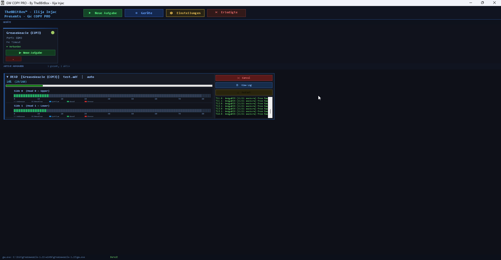

---

## 5. Das Hauptfenster

<!-- SCREENSHOT: images/handbook/05-main-window.png -->

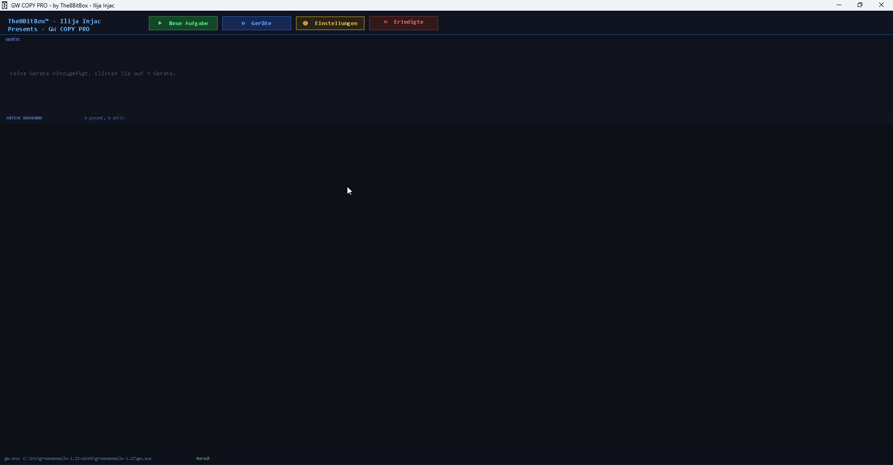

Das Hauptfenster gliedert sich von oben nach unten in vier Bereiche:

### 5.1 Die Werkzeugleiste

| Schaltfläche | Funktion |
|---|---|
| **▶ Neue Aufgabe** | Öffnet den [Dialog „Neue Aufgabe"](#7-eine-aufgabe-anlegen--der-dialog-neue-aufgabe) ohne vorausgewähltes Gerät. |
| **⬡ Geräte** | Öffnet die [Geräteverwaltung](#6-die-geräteverwaltung). |
| **⚙ Einstellungen** | Öffnet den [Einstellungsdialog](#11-einstellungen) (Pfad zu gw.exe, Sprache). |
| **✕ Erledigte löschen** | Entfernt alle Panels *abgeschlossener*, *fehlgeschlagener* und *abgebrochener* Aufgaben aus der Liste. Laufende Aufgaben werden nie angetastet. |

### 5.2 Die Leiste GERÄTE

Eine horizontale Reihe von Gerätekarten, eine pro registriertem GreaseWeazle. Jede Karte
zeigt:

- den von Ihnen vergebenen **Gerätenamen**,
- den **COM-Port** (`Port: COM3`),
- die **Firmware-Version** (`FW: 1.6`), wie von `gw.exe info` gemeldet,
- den **Verbindungsstatus** (● Verbunden / ● Nicht verbunden),
- eine **pulsierende LED** — grün pulsierend bei Verbindung, rot bei Trennung,
- eine Schaltfläche **▶ Neue Aufgabe**, die den Aufgabendialog mit diesem Gerät
  vorausgewählt öffnet,
- eine Schaltfläche **⚡ Blinken**, die die LED des angeschlossenen Laufwerks dreimal
  pulsieren lässt, abwechselnd Laufwerk `0` und Laufwerk `1` — so erkennen Sie, welches
  physische Laufwerk zu welcher Karte gehört, praktisch bei mehreren angeschlossenen
  GreaseWeazles. Sie ist deaktiviert, solange das Gerät nicht verbunden ist oder bereits
  eine andere Blinksequenz läuft; die Statusleiste zeigt währenddessen
  *„Blinke `<Gerät>` (`<Port>`)…"*.
- eine Schaltfläche **×**, die das Gerät aus der Liste entfernt.

Sind keine Geräte registriert, erscheint stattdessen der Hinweis:
*„Keine Geräte hinzugefügt. Klicken Sie auf ⬡ Geräte."*

<!-- SCREENSHOT: images/handbook/05-device-card.png -->
> 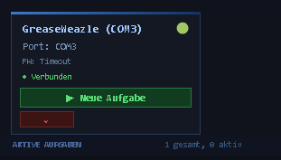

<!-- SCREENSHOT: images/handbook/05-device-card-blink.png -->
*(Platzhalter für Screenshot: eine Gerätekarte mit der neuen Schaltfläche ⚡ Blinken neben
▶ Neue Aufgabe und ×.)*

### 5.3 Der Bereich AKTIVE AUFGABEN

Eine scrollbare Liste von [Aufgaben-Panels](#8-das-aufgaben-panel-und-der-disketten-visualisierer),
eines pro Aufgabe. Die Kopfzeile zeigt einen Live-Zähler, z. B. `3 gesamt, 1 aktiv`.
Aufgaben bleiben nach dem Ende gelistet (damit Sie Protokolle prüfen oder sie neu starten
können), bis Sie **✕ Erledigte löschen** drücken.

Mehrere Aufgaben können auf verschiedenen Geräten **gleichzeitig** laufen — es gibt keine
künstliche Begrenzung. Jede Aufgabe läuft in einem eigenen Hintergrund-Thread.

### 5.4 Die Statusleiste

- **Links:** der aktuell konfigurierte Pfad zu `gw.exe` (`gw.exe: C:\gw\gw.exe`).
- **Rechts:** die jüngste Statusmeldung (Aufgabe gestartet/abgeschlossen, Geräteerkennung,
  Fehler). Meldungen kehren nach 4 Sekunden automatisch zu *„Bereit"* zurück.

---

## 6. Die Geräteverwaltung

Öffnen mit **⬡ Geräte** in der Werkzeugleiste.

<!-- SCREENSHOT: images/handbook/06-device-manager.png -->
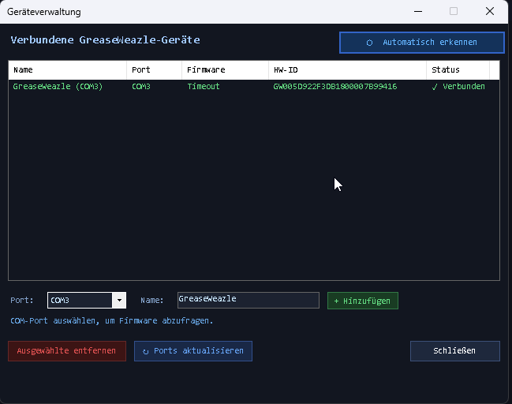

Die Geräteverwaltung erlaubt es, GreaseWeazle-Geräte **zur Laufzeit** anzuzeigen,
hinzuzufügen und zu entfernen — ohne Neustart der Anwendung.

### 6.1 Die Geräteliste

Spalten: **Name**, **Port**, **Firmware**, **HW-ID** (die von Windows gemeldete
Hardware-Kennung) und **Status** (✓ Verbunden / Nicht verbunden). Verbundene Geräte
werden grün dargestellt, getrennte rot.

### 6.2 ⬡ Automatisch erkennen

Klicken Sie **⬡ Automatisch erkennen**, um das System (per Windows-WMI) nach
angeschlossener GreaseWeazle-Hardware zu durchsuchen. Für jedes neu gefundene Gerät führt
GWCopyPro im Hintergrund `gw.exe info --device COMx` aus, um die Firmware-Version
abzufragen, und fügt das Gerät dann der Liste hinzu. Bereits registrierte Geräte werden
übersprungen („Alle erkannten Geräte sind bereits registriert.").

### 6.3 Ein Gerät manuell hinzufügen

Falls die automatische Erkennung Ihr Gerät nicht findet (z. B. bei ungewöhnlichen
USB-Seriell-Adaptern):

1. Wählen Sie den **Port** aus der Ausklappliste (**↻ Ports aktualisieren**, falls Ihr
   Port fehlt). Sobald ein Port gewählt ist, prüft GWCopyPro ihn und zeigt das
   Firmware-Ergebnis an (`COM3 → Firmware: 1.6`).
2. Vergeben Sie einen sprechenden **Namen** (z. B. „GW #1 — 3,5-Zoll-Laufwerk").
3. Klicken Sie **+ Hinzufügen**.

### 6.4 Ein Gerät entfernen

Zeile auswählen und **Ausgewählte entfernen** klicken. Das entfernt das Gerät nur aus der
Liste von GWCopyPro — mit der Hardware passiert nichts.

Mit **Schließen** kehren Sie zum Hauptfenster zurück; die Geräteleiste aktualisiert sich
automatisch.

---

## 7. Eine Aufgabe anlegen — der Dialog „Neue Aufgabe"

Öffnen mit **▶ Neue Aufgabe** (Werkzeugleiste oder Gerätekarte). Dies ist das Herzstück
von GWCopyPro: Fünf Registerkarten decken jede relevante `gw.exe`-Option ab, und eine
**Live-Befehlsvorschau** am unteren Rand des Dialogs zeigt stets die exakte
Kommandozeile, die ausgeführt wird, z. B.:

```
gw.exe read --device COM3 --format ibm.1440 --tracks=c=0-79:h=0-1 --retries 3 "C:\Images\disk1.img"
```

Die Vorschau aktualisiert sich sofort bei jeder Änderung — eine hervorragende Methode, die
`gw.exe`-Syntax nebenbei zu *lernen*.

Am unteren Rand des Dialogs finden Sie außerdem:

| Schaltfläche | Funktion |
|---|---|
| **💾 Preset speichern** | Speichert den kompletten aktuellen Dialogzustand in eine `.gwpreset`-Datei ([Kapitel 10](#10-aufgaben-presets)). |
| **📂 Preset laden** | Lädt eine `.gwpreset`-Datei und füllt alle Felder daraus. |
| **▶ Aufgabe starten** | Prüft die Eingaben und startet die Aufgabe. |
| **Abbrechen** | Schließt den Dialog, ohne etwas zu starten. |

> **Prüfung:** Ohne Wiederholungsmodus muss eine Abbilddatei angegeben sein — andernfalls
> erscheint *„Bitte eine Abbilddatei angeben."* und der Dialog bleibt offen.

### 7.1 Registerkarte „Haupteinstellungen"

<!-- SCREENSHOT: images/handbook/07-tab-main.png -->
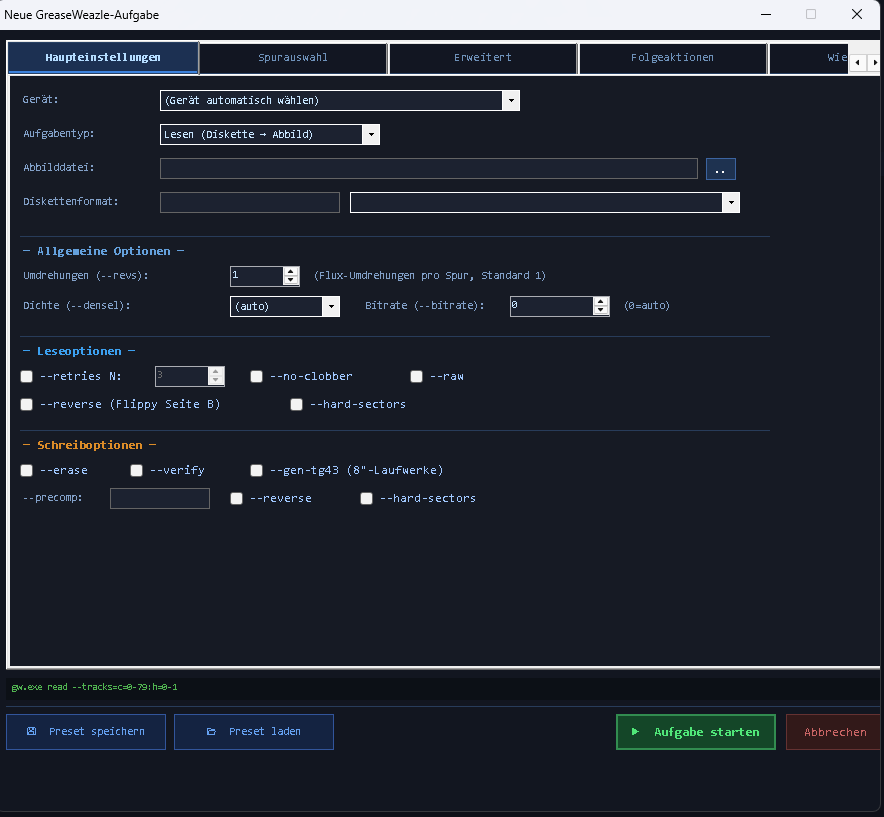

#### Gerät

Legt fest, welcher GreaseWeazle die Aufgabe ausführt. `(Gerät automatisch wählen)`
überlässt `gw.exe` die Auswahl (unproblematisch, wenn nur ein Gerät angeschlossen ist).
Die Wahl eines konkreten Geräts erzeugt `--device COMx`.

#### Aufgabentyp

- **Lesen (Diskette → Abbild)** — liest eine physische Diskette und speichert sie als
  Abbilddatei (`gw.exe read …`).
- **Schreiben (Abbild → Diskette)** — schreibt eine vorhandene Abbilddatei auf eine
  physische Diskette (`gw.exe write …`).

Die Wahl bestimmt, welche Optionsabschnitte gelten (Leseoptionen bzw. Schreiboptionen)
und ob der Dateidialog ein *Speichern*- (Lesen) oder *Öffnen*-Fenster (Schreiben) zeigt.

#### Abbilddatei

Der vollständige Pfad des zu erzeugenden (Lesen) bzw. zu schreibenden (Schreiben)
Diskettenabbilds. Die Schaltfläche **…** öffnet einen Dateidialog. Unterstützte Typen im
Browser: `*.scp`, `*.hfe`, `*.img`, `*.adf` (und `*.ipf` beim Schreiben). Was die
einzelnen Typen bedeuten, erklärt das
[Glossar](#16-glossar--disketten--und-greaseweazle-fachbegriffe).

**Faustregel:**
- Für *Archivierung* oder *unbekannte/geschützte* Disketten: nach **`.scp`** lesen
  (Roh-Fluss — bewahrt alles).
- Für *bekannte Standardformate*, die Sie in Emulatoren nutzen wollen: ein
  *Diskettenformat* wählen und direkt nach **`.img`** (PC), **`.adf`** (Amiga),
  **`.st`**/**`.img`** (Atari ST) usw. lesen.

#### Diskettenformat

Entspricht `--format`. Entweder den Formatnamen direkt in das Textfeld tippen oder einen
Eintrag aus der Schnellauswahlliste wählen, die das Textfeld befüllt. Die Liste umfasst
unter anderem:

| Familie | Formate |
|---|---|
| IBM PC | `ibm.1440`, `ibm.720`, `ibm.1200`, `ibm.360`, `ibm.180`, `ibm.320`, `ibm.800`, `ibm.2880` |
| Amiga | `amiga.amigados`, `amiga.amigados-hd` |
| Atari ST | `atarist.360`, `atarist.400`, `atarist.720`, `atarist.800` |
| Atari 8-Bit | `atari.90`, `atari.130`, `atari.180`, `atari.360` |
| Commodore | `commodore.1541`, `commodore.1571`, `commodore.1581` |
| Apple / Mac | `apple2.525.ss.sd.35`, `apple2.525.ss.sd.40`, `mac.400`, `mac.800` |
| MSX | `msx.1`, `msx.2` |
| NEC PC-98 | `pc98.2hd`, `pc98.2dd`, `pc98.2d` |
| Acorn | `acorn.adfs.s/m/l/d/e/f` |
| DEC | `dec.rx50`, `dec.rx33` |
| Ensoniq | `ensoniq.mirage`, `ensoniq.esq1` |
| Sonstige | `gem.1`, `dragon.40`, `coco.35`, `zx.trdos.ds80` |

Lassen Sie das Feld **leer**, um `--format` ganz wegzulassen (Roh-Fluss-Betrieb — typisch
beim Lesen nach `.scp`). Die vollständige Liste der von Ihrer gw.exe unterstützten Formate
liefert `gw.exe read --help` bzw. das GreaseWeazle-Wiki.

#### Allgemeine Optionen

| Bedienelement | gw.exe-Schalter | Bedeutung |
|---|---|---|
| **Umdrehungen** | `--revs N` | Wie viele volle Diskettenumdrehungen Fluss pro Spur aufgezeichnet werden. Standard 1; höhere Werte (2–5) geben dem Decoder mehr Chancen, schwache oder beschädigte Sektoren zu retten, und werden für manche Kopierschutz-Analysen benötigt. |
| **Dichte** | `--densel hd/dd/ed` | Übersteuert die Dichtewahl-Leitung zum Laufwerk. `(auto)` = gw.exe entscheidet. Siehe *Dichte* im Glossar. |
| **Bitrate** | `--bitrate N` | Erzwingt eine bestimmte Datenrate in kbit/s. `0` = automatisch erkennen (empfohlen). |

#### Leseoptionen (nur bei Leseaufgaben wirksam)

| Bedienelement | gw.exe-Schalter | Bedeutung |
|---|---|---|
| **--retries N** | `--retries N` | Liest eine Spur bis zu N zusätzliche Male, wenn defekte Sektoren erkannt werden. Kontrollkästchen aktivieren und Anzahl setzen (Standard 3). |
| **--no-clobber** | `--no-clobber` | Überschreibt keine Spuren, die im Ausgabeabbild bereits vorhanden sind — nützlich zum *Fortsetzen* eines teilweise abgeschlossenen Lesevorgangs. |
| **--raw** | `--raw` | Zeichnet rohen Fluss auf, ohne ihn durch den Format-Codec zu dekodieren. |
| **--reverse (Flippy Seite B)** | `--reverse` | Kehrt die Spurdaten um — beim Lesen der B-Seite einer „Flippy"-Diskette in einem flippy-modifizierten Laufwerk. |
| **--hard-sectors** | `--hard-sectors` | Aktiviert die Unterstützung hartsektorierter Disketten (mehrere Indexlöcher). |

#### Schreiboptionen (nur bei Schreibaufgaben wirksam)

| Bedienelement | gw.exe-Schalter | Bedeutung |
|---|---|---|
| **--erase** | `--erase` | Löscht jede Spur vor dem Schreiben — empfohlen, wenn die Zieldiskette zuvor ein anderes (insbesondere höherdichtes) Format enthielt. |
| **--verify** | `--verify` | Liest jede geschriebene Spur zurück und vergleicht sie — für wichtige Disketten dringend empfohlen. |
| **--gen-tg43 (8″-Laufwerke)** | `--gen-tg43` | Erzeugt das /TG43-Signal („Track Greater than 43"), das manche 8″-Laufwerke benötigen, um den Schreibstrom auf inneren Spuren zu senken. |
| **--precomp** | `--precomp N` | Schreib-Vorkompensation in Mikrosekunden — verschiebt Flusswechsel geringfügig, um dem magnetischen „Bit-Shift" auf inneren Spuren entgegenzuwirken. Leer lassen = Standard. |
| **--reverse** | `--reverse` | Wie oben, für das Schreiben der Flippy-B-Seite. |
| **--hard-sectors** | `--hard-sectors` | Wie oben, für hartsektorierte Medien. |

### 7.2 Registerkarte „Spurauswahl"

<!-- SCREENSHOT: images/handbook/07-tab-tracks.png -->

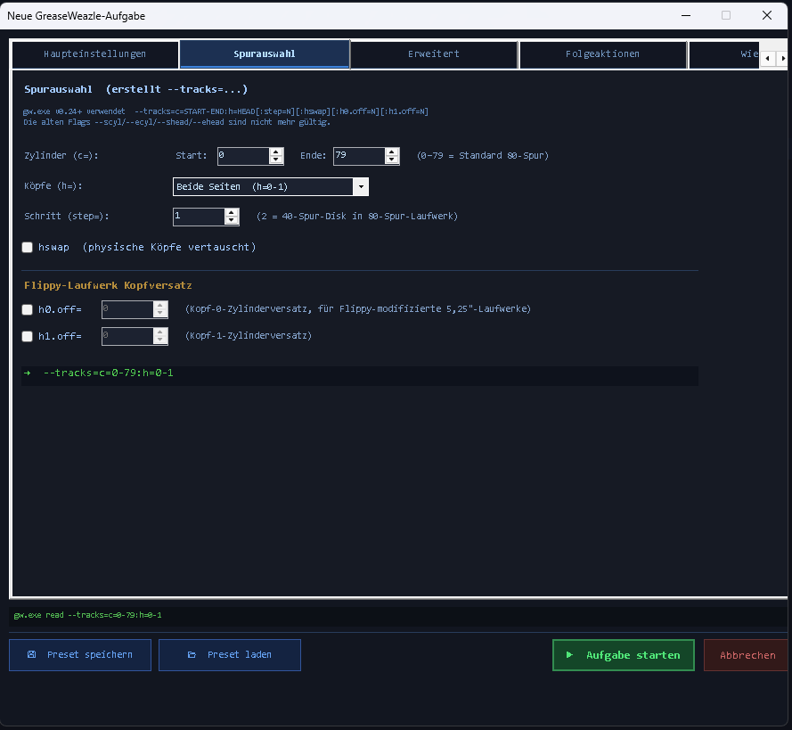

Diese Registerkarte baut den zusammengesetzten `--tracks=`-Spezifizierer, der mit
`gw.exe` v0.24 eingeführt wurde:

```
--tracks=c=START-ENDE:h=KOPF[:step=N][:hswap][:h0.off=N][:h1.off=N]
```

> Die alten Schalter `--scyl`, `--ecyl`, `--shead`, `--ehead`, `--single-sided` wurden in
> v0.24 **entfernt** und werden von GWCopyPro nie erzeugt.

Eine grüne Vorschauzeile am unteren Rand (z. B. `→ c=0-79:h=0-1`) zeigt stets den
resultierenden Spezifizierer. Stehen alle Werte auf Standard, lässt GWCopyPro `--tracks=`
komplett weg und `gw.exe` verarbeitet die ganze Diskette auf beiden Seiten.

| Bedienelement | Spezifikationsteil | Bedeutung |
|---|---|---|
| **Zylinder Start / Ende** | `c=0-79` | Erster und letzter zu verarbeitender Zylinder (einschließlich). 0–79 ist eine Standard-80-Spur-Diskette; 0–39 für 40-Spur-Disketten (5,25″ DD); bis 83 für „Overdumps". |
| **Köpfe** | `h=0-1`, `h=0`, `h=1` | *Beide Seiten*, *nur Kopf 0* (Unterseite) oder *nur Kopf 1* (Oberseite). Einseitige Formate benötigen nur Kopf 0. |
| **Schritt** | `step=2` | Physische Kopfschritte pro logischem Zylinder. **`step=2` ist der klassische Trick, um eine 40-Spur-Diskette in einem 80-Spur-Laufwerk zu lesen** — das Laufwerk macht zwei Schritte pro Datenspur. |
| **hswap** | `hswap` | Vertauscht die Bedeutung von Kopf 0 und Kopf 1 — für Laufwerke mit physisch vertauschter Kopfverkabelung. |
| **h0.off= / h1.off=** | `h0.off=N` / `h1.off=N` | Zylinderversatz pro Kopf (−9…+9), verwendet bei **flippy-modifizierten 5,25″-Laufwerken**, deren einer Kopf um einige Zylinder versetzt sitzt. Zum Aktivieren das Kontrollkästchen anhaken. |

### 7.3 Registerkarte „Erweitert"

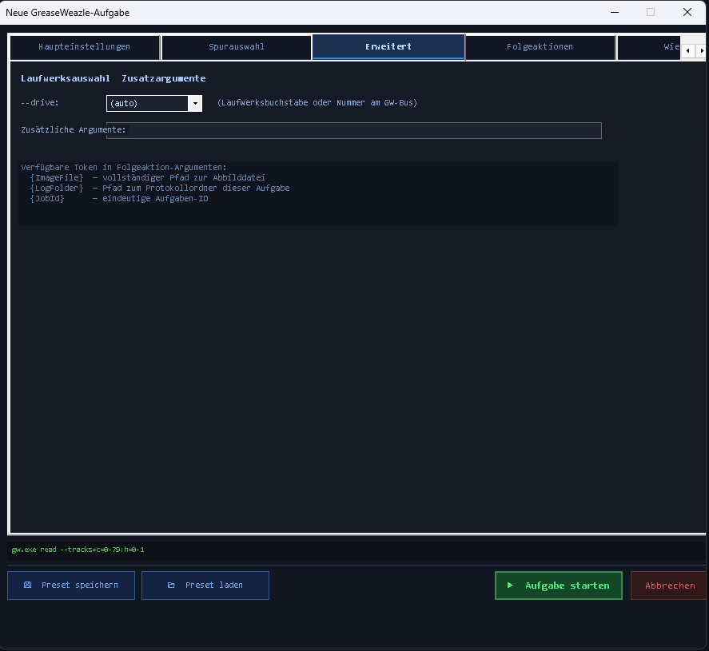

| Bedienelement | Bedeutung |
|---|---|
| **--drive** | Welches Laufwerk am Floppy-Bus des GreaseWeazle verwendet wird: `a`/`b` (IBM-Kabel mit Drehung, „Twist") oder `0`–`3` (gerades Shugart-Kabel). `(auto)` lässt den Schalter weg und nutzt den gw.exe-Standard (Laufwerk 0 / A). |
| **Zusätzliche Argumente** | Ein Freitextfeld, das **wörtlich** ans Ende der Kommandozeile (vor die Abbilddatei) angehängt wird. Für jede `gw.exe`-Option ohne eigenes Bedienelement, z. B. `--fake-index=200ms`, `--dd 0`, `--seek-retries 5` oder formatspezifische Optionen wie `--adjust-speed`. |

Die Registerkarte listet außerdem die in Folgeaktion-Argumenten verfügbaren Token auf
(siehe nächster Abschnitt).

### 7.4 Registerkarte „Folgeaktionen"

<!-- SCREENSHOT: images/handbook/07-tab-postactions.png -->
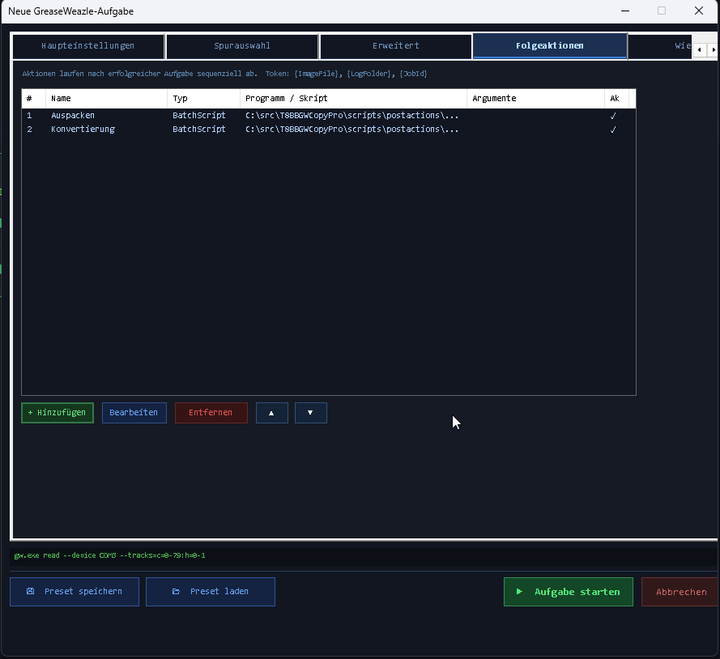

Folgeaktionen sind Programme oder Skripte, die GWCopyPro **automatisch und sequenziell
nach jeder erfolgreichen Aufgabe** ausführt (im Wiederholungsmodus nach **jeder
erfolgreich gelesenen Diskette**). Fehlgeschlagene oder abgebrochene Aufgaben lösen
**keine** Folgeaktionen aus.

Typische Einsatzzwecke: Prüfsummenerzeugung, Validierung, ZIP-Archivierung, Kopieren auf
ein NAS, Konvertierung von Fluss- in Sektorabbilder, Entpacken von Archiven —
gebrauchsfertige Skripte für all das finden Sie in
[Kapitel 14](#14-folgeaktionen-skript-kochbuch).

#### Die Aktionsliste

Spalten: **#** (Ausführungsreihenfolge), **Name**, **Typ**, **Programm / Skript**,
**Argumente**, **Ak** (aktiv ✓ / deaktiviert —).

| Schaltfläche | Funktion |
|---|---|
| **+ Hinzufügen** | Öffnet den Folgeaktions-Editor für eine neue Aktion. |
| **Bearbeiten** | Bearbeitet die ausgewählte Aktion. |
| **Entfernen** | Löscht die ausgewählte Aktion. |
| **▲ / ▼** | Verschiebt die ausgewählte Aktion in der Ausführungsreihenfolge nach oben/unten. |

#### Der Folgeaktions-Editor

<!-- SCREENSHOT: images/handbook/07-postaction-editor.png -->

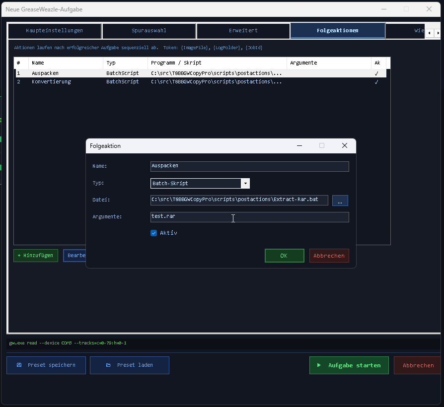

| Feld | Bedeutung |
|---|---|
| **Name** | Anzeigename in der Liste (z. B. „Abbild validieren"). |
| **Typ** | Wie die Aktion gestartet wird — siehe Tabelle unten. |
| **Datei** | Pfad zur `.exe`-, `.bat`- oder `.ps1`-Datei. |
| **Argumente** | Argumentzeile; darf Token enthalten (siehe unten). |
| **Aktiv** | Abwählen überspringt die Aktion, ohne sie zu löschen. |

| Typ | So wird ausgeführt |
|---|---|
| **Programm** | `ihredatei.exe <Argumente>` — direkter Aufruf. |
| **Batch-Skript** | `cmd.exe /c "ihrskript.bat" <Argumente>` |
| **PowerShell-Skript** | `powershell.exe -NoProfile -ExecutionPolicy Bypass -File "ihrskript.ps1" <Argumente>` |

#### Token

Folgende Token im Feld *Argumente* werden zur Laufzeit ersetzt:

| Token | Wird ersetzt durch |
|---|---|
| `{ImageFile}` | Vollständiger Pfad des Diskettenabbilds, das die Aufgabe erzeugt/verwendet hat. |
| `{LogFolder}` | Vollständiger Pfad des Protokollordners der Aufgabe. |
| `{JobId}` | Die eindeutige 8-stellige Aufgaben-ID. |
| `{DiskIndex}` | Die aktuelle Diskettennummer (Wiederholungsmodus; sonst `1`). |

> **Setzen Sie Pfad-Token immer in Anführungszeichen** — z. B. `"{ImageFile}"` — sonst
> zerreißen Pfade mit Leerzeichen die Argumentzerlegung Ihres Skripts.

Die gesamte Ausgabe (stdout und stderr) jeder Folgeaktion wird zusammen mit ihrem Exit-Code
an das `gw_output.log` der Aufgabe angehängt — Sie können also jederzeit nachvollziehen,
was passiert ist.

### 7.5 Registerkarte „Wiederholen"

Wird ausführlich in [Kapitel 9](#9-wiederholungsmodus--ganze-diskettenkisten-digitalisieren)
beschrieben. Diese Registerkarte enthält außerdem das Feld **Preset Name**, das beim
Speichern von Presets verwendet wird, sowie das Kontrollkästchen **Gerätegruppe
verwenden** für Aufgaben, die parallel über mehrere Geräte laufen — siehe
[9.3 Gruppen-Wiederholjobs — paralleles Stapel-Imaging](#93-gruppen-wiederholjobs--paralleles-stapel-imaging).

---

## 8. Das Aufgaben-Panel und der Disketten-Visualisierer

Jede gestartete Aufgabe erhält ein eigenes Panel im Bereich AKTIVE AUFGABEN.

<!-- SCREENSHOT: images/handbook/08-job-panel.png -->


### 8.1 Inhalt des Panels

- **Titelzeile** — Aufgabentyp, Name der Abbilddatei, Gerät.
- **Statuszeile** — z. B. `45% (72/160)`, im Wiederholungsmodus `Disk #3 45% (72/160)`;
  nach Abschluss `Done in 92.4s`, bei Fehler `Error: gw.exe exited with code 1`.
- **Fortschrittsbalken** — Gesamtprozentsatz der fertigen Spuren.
- **Zwei Spurraster** — *Side 0 (Head 0 — Upper)* und *Side 1 (Head 1 — Lower)*, jeweils
  ein Balken aus 84 Zellen, eine Zelle pro Zylinder.
- **Live-Protokollfenster** — die jüngsten `gw.exe`-Ausgabezeilen, in Echtzeit scrollend.
- **Schaltflächen:**

| Schaltfläche | Funktion |
|---|---|
| **✕ Abbrechen** | Bricht diese Aufgabe ab: Der `gw.exe`-Prozess (samt Kindprozessen) wird beendet und die Aufgabe als *abgebrochen* markiert. |
| **📄 Protokoll** | Öffnet den Protokollordner der Aufgabe im Windows-Explorer (bzw. die Protokolldatei in Notepad, wenn nur die Datei existiert). |
| **↺ Neustart** | Verfügbar, sobald die Aufgabe beendet ist — öffnet den Dialog „Neue Aufgabe" erneut, vorbefüllt mit exakt der Konfiguration dieser Aufgabe (aus ihrem Preset-Schnappschuss). |

### 8.2 Zellfarben

| Farbe | Status | Bedeutung |
|---|---|---|
| Dunkelgrau | Unbekannt | Nicht Teil des gewählten Spurbereichs / nicht gestartet. |
| Mittelgrau | Wartend | Eingereiht, noch nicht verarbeitet. |
| **Blau** | Lesen/Schreiben | Wird gerade verarbeitet. |
| **Grün** | Gut | Spur erfolgreich abgeschlossen. |
| **Rot** | Fehler | gw.exe hat für diese Spur einen Fehler gemeldet (defekte Sektoren usw.). |

Die Zellen werden durch das Auswerten von `gw.exe`-Ausgabezeilen wie `T12.0: ok` oder
`Cyl 12, Head 0: reading` gesteuert. Für gw.exe-Versionen mit abweichender Ausgabe sorgt
ein Ersatz-Parser für `n/m`-Fortschrittsbrüche dafür, dass der Fortschrittsbalken
weiterläuft, auch wenn einzelne Zellen nicht zugeordnet werden können.

> Einige **rote Zellen** bedeuten nicht zwangsläufig eine fehlgeschlagene Aufgabe: Beendet
> sich `gw.exe` mit Exit-Code 0, gilt die Aufgabe als *abgeschlossen* — rote Zellen
> markieren dann Spuren, die trotz Wiederholungen Lesefehler hatten. Prüfen Sie das
> Protokoll und erwägen Sie ein erneutes Lesen mit mehr `--retries` oder `--revs`.

---

## 9. Wiederholungsmodus — ganze Diskettenkisten digitalisieren

Der Wiederholungsmodus ist für Massen-Digitalisierung gemacht: Sie konfigurieren eine
Aufgabe **einmal**, und GWCopyPro wiederholt sie Diskette für Diskette mit automatischer
Dateinummerierung.

### 9.1 Konfiguration (Registerkarte „Wiederholen")

<!-- SCREENSHOT: images/handbook/09-tab-repeat.png -->
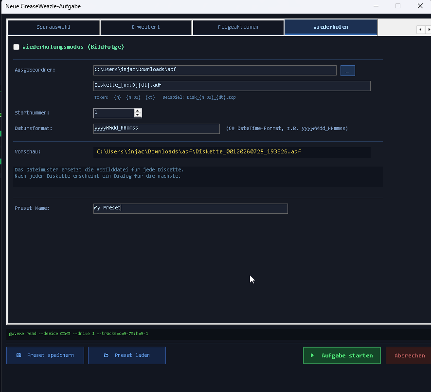

1. Aktivieren Sie **Wiederholungsmodus (Bildfolge)**.
2. Wählen Sie einen **Ausgabeordner** (leer lassen = Ordner der Abbilddatei; ist beides
   leer, wird der Desktop verwendet).
3. Geben Sie ein **Dateimuster** mit Token ein:

| Token | Bedeutung | Beispiel (`Disk_{n:D3}_{dt}.scp`, Diskette 7) |
|---|---|---|
| `{n}` | Diskettenzähler als einfache Zahl | `Disk_7_….scp` |
| `{n:D3}` | Zähler mit .NET-Format (`D3` = 3-stellig, mit führenden Nullen) | `Disk_007_….scp` |
| `{dt}` | Zeitstempel gemäß Feld *Datumsformat* | `Disk_007_20260728_143022.scp` |

4. Setzen Sie die **Startnummer** (erster Zählerwert, Standard 1) und passen Sie bei
   Bedarf das **Datumsformat** an (eine C#-`DateTime`-Formatzeichenkette, Standard
   `yyyyMMdd_HHmmss`).
5. Die Zeile **Vorschau** zeigt exakt, wie die erste Datei heißen wird.

> Das Dateimuster **ersetzt** das Feld *Abbilddatei* für jede Diskette. Enthält das
> Muster gar kein Token, greift der Wiederholungsmodus nicht und es läuft eine normale
> Einzelaufgabe.

### 9.2 Der Ablauf

1. Die Aufgabe läuft für Diskette Nr. 1 genau wie eine normale Aufgabe (einschließlich
   Folgeaktionen).
2. Ist die Diskette fertig, erscheint der Dialog **Nächste Diskette**:

<!-- SCREENSHOT: images/handbook/09-next-disk-device-line.png -->
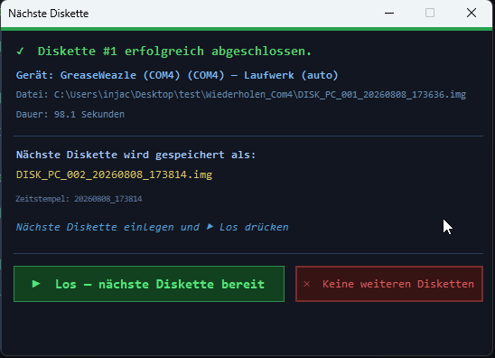

   - eine Zeile **„Gerät: `<Name>` — Laufwerk `<Adresse>`"**, die anzeigt, welcher
     GreaseWeazle und welches Laufwerk diese Diskette erzeugt hat (und die nächste
     erzeugen wird); ohne explizite Auswahl steht dort „(auto)",
   - `✓ Diskette #3 erfolgreich abgeschlossen.` — mit geschriebenem Dateinamen und Dauer,
   - der Dateiname, den die **nächste** Diskette erhalten wird,
   - eine pulsierende Aufforderung: *„Nächste Diskette einlegen und ▶ Los drücken"*.

3. Diskette wechseln, **▶ Los — nächste Diskette bereit** drücken — der Zähler erhöht
   sich und die nächste Diskette wird ausgelesen. Mit **✕ Keine weiteren Disketten**
   beenden Sie die Sitzung; die Aufgabe wird dann als *abgeschlossen* markiert, mit
   Zusammenfassung (`Done — 12 disk(s) in …`).

Das Spurraster wird für jede Diskette zurückgesetzt, und jede Diskette bekommt einen
**eigenen Protokollordner** (`…_disk1`, `…_disk2`, …). Folgeaktionen laufen nach
**jeder** Diskette, wobei `{DiskIndex}` die aktuelle Nummer enthält — ideal für
Validierung oder Archivierung pro Diskette.

> Diese Geräte-/Laufwerkszeile erscheint nur bei **Einzelgerät**-Wiederholjobs.
> Gruppenaufträge (siehe unten) zeigen den Dialog „Nächste Diskette" nie — der
> Stapel-Einlege-Dialog liefert die Geräteinformation pro Laufwerk stattdessen.

### 9.3 Gruppen-Wiederholjobs — paralleles Stapel-Imaging

Um größere Sammlungen schneller zu digitalisieren, kann der Wiederholungsmodus statt
eines einzelnen Geräts eine **Gerätegruppe** ansteuern: Mehrere GreaseWeazle-Geräte
imagen gleichzeitig einen Stapel Disketten, geführt durch eine LED-Blink-und-
Verifizieren-Sequenz, damit Sie immer die richtige Diskette in das richtige Laufwerk
einlegen.

#### Eine Gruppe einrichten

Auf der Registerkarte **Wiederholen**, unterhalb der normalen Wiederholungs-Bedienelemente:

1. Aktivieren Sie **„Gerätegruppe verwenden (paralleles Stapel-Imaging)"** — nur
   verfügbar, solange auch der Wiederholungsmodus aktiviert ist. Die einzelnen
   Geräte-/Laufwerksauswahlfelder an anderer Stelle im Dialog werden deaktiviert, solange
   eine Gruppe aktiv ist; die Mitgliederliste ersetzt sie.
2. Wählen Sie für jedes gewünschte Laufwerk ein **Gerät** und ein **Laufwerk**
   (`0` / `1` / `a` / `b`) und klicken Sie **+ Hinzufügen**; das Paar wird der
   Mitgliederliste angehängt, in der Reihenfolge, in der die Laufwerke später blinken
   werden. Zeile auswählen und **− Entfernen** klicken, um sie wieder zu entfernen.
3. Eine Gruppe benötigt **mindestens zwei Mitglieder**, und dasselbe physische
   GreaseWeazle-Gerät darf nicht doppelt vorkommen — paralleles Imaging benötigt ein
   Gerät pro Laufwerk, da `gw.exe` einen COM-Port exklusiv belegt.

<!-- SCREENSHOT: images/handbook/09-group-newjob-tab.png -->
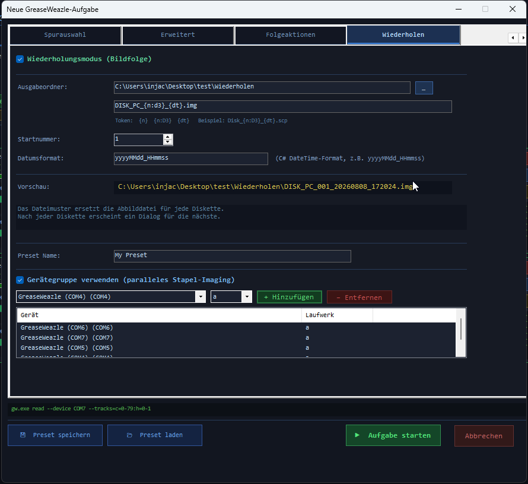

Die Gruppenkonfiguration wird wie jede andere Einstellung in Job-Presets gespeichert und
geladen — auch wenn ein gespeichertes Preset auf ein nicht mehr verbundenes Gerät
verweist.

#### Der Stapel-Einlege-Dialog

Beim Start eines Gruppenauftrags — und erneut nach jedem abgeschlossenen Stapel — öffnet
sich der **Stapel-Einlege-Dialog**, der bei Gruppenaufträgen an die Stelle des
gewöhnlichen Dialogs „Nächste Diskette" tritt:

<!-- SCREENSHOT: images/handbook/09-group-batch-insert.png -->
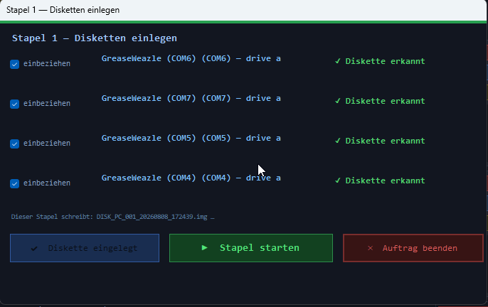

- Der Kopfbereich zeigt die Stapelnummer und eine Vorschau der Dateinamen, die dieser
  Stapel erzeugen wird.
- Eine Zeile pro Gruppenmitglied — Gerätename, COM-Port und Laufwerk, ein
  **einbeziehen**-Kontrollkästchen sowie ein Status:

| Status | Bedeutung |
|---|---|
| `wartet` | Diese Zeile ist noch nicht an der Reihe zu blinken. |
| `● DISKETTE EINLEGEN — LED blinkt` | Die LED dieses Laufwerks pulsiert jetzt — Diskette einlegen. |
| `✓ Diskette erkannt` | Sie haben bestätigt, dass in diesem Laufwerk eine Diskette liegt. |
| `— ausgeschlossen` | Dieses Laufwerk wird im aktuellen Stapel übersprungen. |

  Eine Zeile zeigt außerdem, sobald verfügbar, das Ergebnis des vorherigen Stapels
  (`zuletzt: ✓ <Dateiname>` bzw. `zuletzt: ✗ <Fehler>`).

- **Nur ein Laufwerk blinkt gleichzeitig**, in der Reihenfolge der Mitgliederliste,
  ausgeschlossene Zeilen werden übersprungen. Klicken Sie **✔ Diskette eingelegt**,
  sobald Sie eine Diskette in das gerade blinkende Laufwerk eingelegt haben, um sofort
  zur nächsten einbezogenen, noch nicht verifizierten Zeile weiterzuspringen. GWCopyPro
  prüft das Laufwerk vor dem Weiterspringen nicht auf eine eingelegte Diskette —
  gw.exe hat keine zuverlässige, dedizierte Methode zur Diskettenerkennung, daher wird
  Ihre Bestätigung direkt übernommen. Stellt sich ein Laufwerk als leer heraus oder
  schlägt es anderweitig fehl, meldet nur dieses Mitglied einen Fehler, ohne den Rest
  des Stapels zu blockieren (siehe unten).
- Das Abwählen von **einbeziehen** bei der gerade blinkenden Zeile überspringt sie
  sofort; erneutes Aktivieren hängt sie wieder ans Ende der Blink-Warteschlange an — der
  Ausschluss gilt jeweils nur für den aktuellen Stapel und ist vollständig reversibel.
- **▶ Stapel starten** wird erst aktiv, sobald jedes einbezogene Laufwerk „Diskette
  erkannt" meldet. Alle einbezogenen Laufwerke imagen dann ihre Diskette **parallel**,
  jedes mit eigenem Job-Panel und Live-Track-Visualisierung im Hauptfenster, genau wie
  bei einer normalen Aufgabe.
- Schlägt die Diskette eines Laufwerks fehl, laufen die anderen unbeeinträchtigt weiter;
  der Fehler wird in der Zeile dieses Laufwerks im nächsten Stapel gemeldet, und die
  Diskettennummer wird für eine spätere Diskette nie wiederverwendet.
- **✕ Auftrag beenden** beendet die Gruppensitzung jederzeit (auch durch Schließen des
  Dialogs ausgelöst); die Aufgabe wird dann als *abgeschlossen* markiert, mit einer
  Zusammenfassung aller geschriebenen Disketten.

Folgeaktionen laufen pro fertiggestellter Diskette genau wie bei einer normalen Aufgabe,
wobei `{DiskIndex}` die Nummer dieser Diskette trägt.

> **Tipp:** Sie müssen nicht bei jedem Stapel jedes Laufwerk befüllen — schließen Sie ein
> Laufwerk aus, dessen nächste Diskette noch nicht bereitliegt, und beziehen Sie es bei
> einem späteren Stapel wieder ein.

> **Abbrechen eines Gruppenauftrags** beendet die `gw.exe`-Prozesse aller Mitglieder,
> genau wie beim Abbrechen einer normalen Aufgabe.

---

## 10. Aufgaben-Presets

Ein Preset speichert **alles** aus dem Dialog „Neue Aufgabe": Gerät, Aufgabentyp, Format,
alle Schalter, Spurauswahl, Folgeaktionen und die komplette Wiederholungs-Konfiguration.

- **💾 Preset speichern** (Dialog „Neue Aufgabe") — schreibt eine JSON-Datei mit der
  Endung `.gwpreset`, standardmäßig nach `%APPDATA%\GreaseWeazleManager\Presets\`. Der
  Dateiname wird aus dem Feld **Preset Name** auf der Registerkarte *Wiederholen*
  abgeleitet.
- **📂 Preset laden** — lädt eine `.gwpreset`-Datei und befüllt sämtliche Felder daraus.
- **↺ Neustart** (Aufgaben-Panel) — jede gestartete Aufgabe behält intern einen
  Schnappschuss ihrer Konfiguration; Neustart öffnet den Dialog damit vorbefüllt, selbst
  wenn Sie nie eine Preset-Datei gespeichert haben.

Da Presets reines JSON sind, können Sie sie problemlos einsehen, sichern und
weitergeben.

**Beispiel-Arbeitsablauf:** Legen Sie einmalig die Presets „Amiga DD → ADF",
„PC 1,44 MB → IMG" und „Unbekannte Diskette → SCP-Roharchiv (3 Umdrehungen)" an — danach
beginnt jede Digitalisierungssitzung mit zwei Klicks.

---

## 11. Einstellungen

Öffnen mit **⚙ Einstellungen**.

<!-- SCREENSHOT: images/handbook/11-settings.png -->
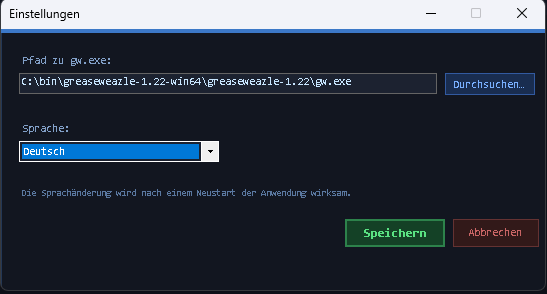

| Einstellung | Bedeutung |
|---|---|
| **Pfad zu gw.exe** | Vollständiger Pfad zu Ihrer `gw.exe`. Standard ist schlicht `gw.exe`, was funktioniert, wenn der gw-Tools-Ordner im `PATH` liegt. Mit **Durchsuchen…** wählen Sie die Datei aus. |
| **Sprache** | English oder Deutsch. Die Änderung wird beim **Speichern** angewendet; einige Elemente aktualisieren sich erst nach einem Neustart der Anwendung vollständig. |

> Nachdem Sie **Speichern** geklickt haben, beschriftet sich die Schaltfläche
> **Abbrechen** selbst als **OK** um — eine kurze visuelle Bestätigung, dass Ihre
> Änderungen auf die Festplatte geschrieben wurden. Sie schließt weiterhin nur den
> Dialog (nichts wird rückgängig gemacht); es gibt also keinen separaten
> „Übernehmen"-Schritt zu merken.

<!-- SCREENSHOT: images/handbook/11-settings-ok.png -->
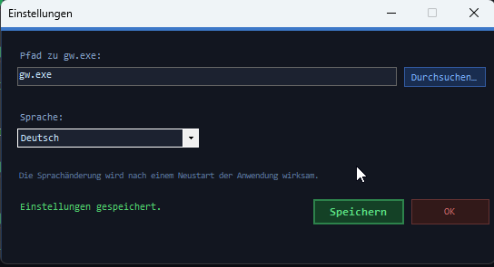

Die Einstellungen werden in `%APPDATA%\GreaseWeazleManager\settings.json` gespeichert und
bleiben über Sitzungen hinweg erhalten.

---

## 12. Protokollierung

Jede Aufgabe schreibt ein vollständiges Protokoll:

```
<Anwendungsordner>\Logs\
    Job_Read_a1b2c3d4_20260728_143022\          ← ein Ordner pro Aufgabe
        gw_output.log
    Job_Read_e5f6a7b8_20260728_150001_disk1\    ← Wiederholungsmodus: ein Ordner pro Diskette
    Job_Read_e5f6a7b8_20260728_150001_disk2\
```

`gw_output.log` enthält:

1. Einen Kopf mit Aufgabentyp, Gerät, Diskettennummer, der **vollständigen
   gw.exe-Kommandozeile** und der Startzeit.
2. Jede stdout-Zeile von `gw.exe`, live; stderr-Zeilen mit Präfix `[ERR]`.
3. Die Abschlussmarkierung (`[COMPLETED]`, `[CANCELLED]`, `[ERROR] Exit code: N` oder
   `[EXCEPTION] …`).
4. Einen Abschnitt `=== Post-Actions ===` mit dem Befehl jeder Folgeaktion, ihrer Ausgabe
   und ihrem Exit-Code (`[ACTION] Exit: 0`).

Die Schaltfläche **📄 Protokoll** am Aufgaben-Panel führt Sie direkt zum Ordner.

> **Tipp:** Das Protokoll enthält immer die exakte Kommandozeile — kopieren Sie sie in
> ein Terminal, um einen Lauf manuell zu reproduzieren oder feinzujustieren.

---

## 13. Akustische und visuelle Rückmeldung

GWCopyPro signalisiert wichtige Ereignisse auch akustisch (praktisch, wenn Sie gerade
Disketten sortieren und nicht auf den Bildschirm schauen):

| Ereignis | Ton | Visuell |
|---|---|---|
| Aufgabe gestartet | Zwei aufsteigende Pieptöne | Meldung in der Statusleiste |
| Aufgabe / Diskette abgeschlossen | Drei aufsteigende Pieptöne | Grüne Statusmeldung, grüne Spurzellen |
| Aufgabenfehler | Drei absteigende Pieptöne | Rote Statusmeldung + der Hauptfensterhintergrund blinkt viermal rot |
| Spurfehler | — | Rote Zelle im Visualisierer |

---

## 14. Folgeaktionen-Skript-Kochbuch

Dieses Kapitel enthält **gebrauchsfertige Skripte** für die Registerkarte Folgeaktionen.
Kopien aller Skripte liegen im Repository-Ordner
[`scripts/postactions/`](../scripts/postactions/) — kopieren Sie sie an einen beliebigen
Ort (z. B. neben `GWCopyPro.exe` in einen Ordner `scripts\`) und verweisen Sie im
Folgeaktions-Editor darauf.

**Allgemeines Konfigurationsmuster** (Folgeaktions-Editor):

| Feld | Wert |
|---|---|
| Typ | *PowerShell-Skript* (für `.ps1`) bzw. *Batch-Skript* (für `.bat`) |
| Datei | vollständiger Pfad zum Skript |
| Argumente | wie beim jeweiligen Rezept angegeben — **Anführungszeichen um die Token beibehalten!** |

Alle Skripte schreiben ihren Fortschritt nach stdout, der im `gw_output.log` der Aufgabe
landet.

*(Die Skript-Kommentare sind auf Englisch gehalten, damit beide Handbuchsprachen dieselben
Skriptdateien verwenden können.)*

### 14.1 Archive entpacken mit den mitgelieferten lsar.exe / unar.exe

GWCopyPro liefert die Kommandozeilenwerkzeuge von *The Unarchiver* im Ordner `tools\` mit:

- **`lsar.exe`** — *listet* den Inhalt eines Archivs (zip, rar, 7z, lha/lzh, adz, …).
- **`unar.exe`** — *entpackt* Archive nahezu jedes Typs.

Das ist praktisch, wenn Ihre Diskettenabbilder (oder die Software, die Sie auf Diskette
schreiben möchten) in Archiven ankommen: `.zip`, `.rar`, `.lha` (in der Amiga-Welt sehr
verbreitet), `.7z` und sogar `.adz` (gzip-komprimiertes ADF).

Grundlegende manuelle Verwendung:

```
lsar.exe "C:\Downloads\spiele.rar"                          Inhalt auflisten
unar.exe -force-overwrite -o "C:\Entpackt" "spiele.rar"     Alles nach C:\Entpackt entpacken
```

#### Skript: `Extract-Archive.ps1`

Listet ein Archiv mit `lsar.exe`, entpackt es mit `unar.exe` und meldet jedes gefundene
Diskettenabbild (`.adf`, `.scp`, `.img`, `.st`, `.hfe`, `.ipf`, …):

```powershell
<#  Extract-Archive.ps1
    Lists an archive with lsar.exe and extracts it with unar.exe.
    Reports all disk images found after extraction.

    Post-Action setup:
      Typ:       PowerShell-Skript
      Datei:     C:\...\scripts\postactions\Extract-Archive.ps1
      Argumente: -Archive "{ImageFile}" -Destination "D:\Entpackt"
#>
param(
    [Parameter(Mandatory = $true)][string]$Archive,
    [string]$Destination = "",
    [string]$ToolsDir    = ""
)

$ErrorActionPreference = "Stop"

# Locate lsar/unar: explicit -ToolsDir, then tools\ next to this script's
# grandparent (repo layout), then tools\ next to GWCopyPro.exe, then PATH.
function Find-Tool([string]$name) {
    $candidates = @()
    if ($ToolsDir) { $candidates += (Join-Path $ToolsDir $name) }
    $candidates += (Join-Path $PSScriptRoot "..\..\tools\$name")
    $candidates += (Join-Path (Split-Path $PSScriptRoot -Parent) "tools\$name")
    $candidates += (Join-Path (Get-Location) "tools\$name")
    foreach ($c in $candidates) { if (Test-Path $c) { return (Resolve-Path $c).Path } }
    $cmd = Get-Command $name -ErrorAction SilentlyContinue
    if ($cmd) { return $cmd.Source }
    throw "$name not found. Pass -ToolsDir <folder containing lsar.exe/unar.exe>."
}

$lsar = Find-Tool "lsar.exe"
$unar = Find-Tool "unar.exe"

if (-not (Test-Path $Archive)) { throw "Archive not found: $Archive" }

if (-not $Destination) {
    $Destination = Join-Path (Split-Path $Archive -Parent) `
                   ([IO.Path]::GetFileNameWithoutExtension($Archive))
}
New-Item -ItemType Directory -Force -Path $Destination | Out-Null

Write-Output "=== Archive contents ($([IO.Path]::GetFileName($Archive))) ==="
& $lsar $Archive

Write-Output "=== Extracting to $Destination ==="
& $unar -force-overwrite -output-directory $Destination $Archive
if ($LASTEXITCODE -ne 0) { throw "unar.exe failed with exit code $LASTEXITCODE" }

$imageExt = ".adf", ".adz", ".scp", ".img", ".ima", ".st", ".hfe", ".ipf", ".d64", ".dsk"
$images = Get-ChildItem $Destination -Recurse -File |
          Where-Object { $imageExt -contains $_.Extension.ToLower() }

Write-Output "=== Disk images found: $($images.Count) ==="
$images | ForEach-Object { Write-Output "  $($_.FullName)  ($($_.Length) bytes)" }
exit 0
```

Typische Einsatzfälle:

- **Schreibaufgaben vorbereiten:** Sie verwalten `.lha`-/`.zip`-Archive mit
  Amiga-Software; führen Sie das Skript manuell (oder als Folgeaktion einer
  „Dummy"-Aufgabe) aus, um die `.adf`-Dateien auszupacken, und schreiben Sie diese dann
  mit einer Schreibaufgabe.
- **Nachbearbeitung von Downloads, die im Ausgabeordner landen.**

> **Hinweis zu `unrar.exe`:** Das oft genannte `unrar.exe` ist *nicht* im Lieferumfang —
> es ist der kostenlose Kommandozeilen-Entpacker der WinRAR-Macher
> ([rarlab.com](https://www.rarlab.com/rar_add.htm)). `unar.exe` entpackt RAR-Archive
> bereits, Sie brauchen es also normalerweise nicht. Wer dennoch unrar bevorzugt: siehe
> nächstes Rezept.

#### Skript: `Extract-Rar.bat` (mit unrar.exe)

```bat
@echo off
REM  Extract-Rar.bat — extracts a RAR archive with unrar.exe
REM
REM  Requires unrar.exe (https://www.rarlab.com/rar_add.htm) — either on PATH
REM  or adjust the UNRAR variable below.
REM
REM  Post-Action setup:
REM    Typ:       Batch-Skript
REM    Datei:     C:\...\scripts\postactions\Extract-Rar.bat
REM    Argumente: "{ImageFile}" "D:\Entpackt"
REM
set "UNRAR=unrar.exe"

if "%~1"=="" (
    echo Usage: Extract-Rar.bat archive.rar [destination]
    exit /b 2
)

set "DEST=%~2"
if "%DEST%"=="" set "DEST=%~dp1%~n1"
if not exist "%DEST%" mkdir "%DEST%"

echo === Listing %~nx1 ===
"%UNRAR%" l "%~1"

echo === Extracting to %DEST% ===
"%UNRAR%" x -y -o+ "%~1" "%DEST%\"
if errorlevel 1 (
    echo [ERROR] unrar failed with exit code %errorlevel%
    exit /b 1
)
echo Done.
exit /b 0
```

### 14.2 Abbilder und Ausgabeordner zippen

#### Skript: `Zip-Image.ps1` — das gerade erzeugte Abbild komprimieren

```powershell
<#  Zip-Image.ps1
    Compresses the finished disk image into a .zip placed next to it.

    Post-Action setup:
      Typ:       PowerShell-Skript
      Datei:     C:\...\scripts\postactions\Zip-Image.ps1
      Argumente: -ImageFile "{ImageFile}"
      Optional:  -DeleteOriginal  entfernt anschließend das unkomprimierte Abbild.
#>
param(
    [Parameter(Mandatory = $true)][string]$ImageFile,
    [switch]$DeleteOriginal
)

$ErrorActionPreference = "Stop"
if (-not (Test-Path $ImageFile)) { throw "Image not found: $ImageFile" }

$zip = [IO.Path]::ChangeExtension($ImageFile, ".zip")
Compress-Archive -Path $ImageFile -DestinationPath $zip -CompressionLevel Optimal -Force

$src = (Get-Item $ImageFile).Length
$dst = (Get-Item $zip).Length
Write-Output ("Zipped {0} -> {1}  ({2:N0} -> {3:N0} bytes, {4:P0} of original)" -f `
    [IO.Path]::GetFileName($ImageFile), [IO.Path]::GetFileName($zip), $src, $dst, ($dst / $src))

if ($DeleteOriginal) {
    Remove-Item $ImageFile
    Write-Output "Original image deleted."
}
exit 0
```

#### Skript: `Zip-OutputFolder.ps1` — den kompletten Ausgabeordner archivieren

Ideal als *letzte* Aktion einer Wiederholungssitzung — oder manuell nach einem
Stapellauf:

```powershell
<#  Zip-OutputFolder.ps1
    Compresses ALL disk images in a folder into one timestamped zip archive.

    Post-Action setup:
      Typ:       PowerShell-Skript
      Datei:     C:\...\scripts\postactions\Zip-OutputFolder.ps1
      Argumente: -Folder "D:\FloppyImages"
      (oder:     -Folder "{ImageFile}"  um den Ordner des Abbilds zu verwenden)
#>
param(
    [Parameter(Mandatory = $true)][string]$Folder,
    [string]$ZipPath = ""
)

$ErrorActionPreference = "Stop"

# Accept either a folder or a file (then its parent folder is used)
if (Test-Path $Folder -PathType Leaf) { $Folder = Split-Path $Folder -Parent }
if (-not (Test-Path $Folder)) { throw "Folder not found: $Folder" }

if (-not $ZipPath) {
    $stamp   = Get-Date -Format "yyyyMMdd_HHmmss"
    $ZipPath = Join-Path $Folder ("Images_{0}.zip" -f $stamp)
}

$imageExt = ".adf", ".adz", ".scp", ".img", ".ima", ".st", ".hfe", ".ipf", ".d64", ".dsk"
$files = Get-ChildItem $Folder -File |
         Where-Object { $imageExt -contains $_.Extension.ToLower() }

if ($files.Count -eq 0) { Write-Output "No disk images found in $Folder - nothing to do."; exit 0 }

Compress-Archive -Path $files.FullName -DestinationPath $ZipPath -CompressionLevel Optimal -Force
Write-Output ("Archived {0} image(s) into {1}" -f $files.Count, $ZipPath)
exit 0
```

### 14.3 Abbilder validieren

#### Skript: `Validate-Image.ps1` — Plausibilitätsprüfung + SHA-256-Prüfsumme

Prüft, ob das Abbild existiert, nicht leer ist und eine plausible Größe für seinen Typ
hat, und schreibt eine `.sha256`-Prüfsummendatei für die Langzeit-Integritätsprüfung:

```powershell
<#  Validate-Image.ps1
    Validates a freshly created disk image:
      1. File exists and is not zero bytes.
      2. File size matches the expected size for known image types (warning only).
      3. Writes a SHA-256 checksum to "<image>.sha256".
    Exit code 0 = OK, 1 = validation failed (visible in gw_output.log).

    Post-Action setup:
      Typ:       PowerShell-Skript
      Datei:     C:\...\scripts\postactions\Validate-Image.ps1
      Argumente: -ImageFile "{ImageFile}"
#>
param(
    [Parameter(Mandatory = $true)][string]$ImageFile
)

$ErrorActionPreference = "Stop"

if (-not (Test-Path $ImageFile)) {
    Write-Output "[FAIL] Image file does not exist: $ImageFile"
    exit 1
}

$item = Get-Item $ImageFile
if ($item.Length -eq 0) {
    Write-Output "[FAIL] Image file is empty (0 bytes): $ImageFile"
    exit 1
}

# Expected sizes (bytes) for common sector-image types. Flux formats (.scp/.hfe)
# have variable sizes and are only checked for non-emptiness.
$expected = @{
    ".adf" = @(901120, 1802240)                              # Amiga DD / HD
    ".img" = @(184320, 327680, 368640, 737280, 819200,
               1228800, 1474560, 2949120)                    # common PC sizes
    ".ima" = @(737280, 1474560)
    ".st"  = @(368640, 409600, 737280, 819200)               # Atari ST
    ".d64" = @(174848, 175531)                               # C64 1541 (w/o + with error info)
}

$ext = $item.Extension.ToLower()
if ($expected.ContainsKey($ext)) {
    if ($expected[$ext] -contains $item.Length) {
        Write-Output ("[OK]   Size check passed: {0:N0} bytes is valid for {1}" -f $item.Length, $ext)
    } else {
        Write-Output ("[WARN] Unusual size for {0}: {1:N0} bytes (expected one of: {2})" -f `
            $ext, $item.Length, ($expected[$ext] -join ", "))
    }
} else {
    Write-Output ("[INFO] No size table for {0} - skipping size check ({1:N0} bytes)." -f $ext, $item.Length)
}

$hash = (Get-FileHash $ImageFile -Algorithm SHA256).Hash
$sidecar = "$ImageFile.sha256"
"$hash *$([IO.Path]::GetFileName($ImageFile))" | Out-File -FilePath $sidecar -Encoding ascii
Write-Output "[OK]   SHA-256: $hash"
Write-Output "[OK]   Checksum written to $sidecar"
exit 0
```

> Später können Sie ein Abbild jederzeit gegen seine Prüfsummendatei verifizieren:
> `certutil -hashfile abbild.adf SHA256` ausführen und vergleichen — oder ein beliebiges
> Prüfsummenwerkzeug verwenden.

### 14.4 Flussabbilder in Sektorabbilder konvertieren

`gw.exe` kann selbst zwischen Abbildtypen konvertieren (`gw convert`). Ein klassischer
Arbeitsablauf: Alles zur Archivierung als rohes `.scp`-Flussabbild lesen und automatisch
ein nutzbares `.adf` oder `.img` ableiten:

#### Skript: `Convert-Image.bat`

```bat
@echo off
REM  Convert-Image.bat — converts a flux image (e.g. .scp) to a sector image
REM  using "gw.exe convert".
REM
REM  Usage: Convert-Image.bat "image.scp" <format> <target-extension>
REM  Beispiel-Argumente im Folgeaktions-Editor:
REM      "{ImageFile}" amiga.amigados adf        -> image.adf
REM      "{ImageFile}" ibm.1440 img              -> image.img
REM
REM  GW unten anpassen, falls gw.exe nicht im PATH liegt.
set "GW=gw.exe"

if "%~3"=="" (
    echo Usage: Convert-Image.bat image.scp format target-extension
    exit /b 2
)

echo Converting %~nx1 to %~n1.%3 (format %2) ...
"%GW%" convert --format %2 "%~1" "%~dpn1.%3"
if errorlevel 1 (
    echo [ERROR] gw convert failed with exit code %errorlevel%
    exit /b 1
)
echo Done: %~dpn1.%3
exit /b 0
```

### 14.5 Fertige Abbilder an einen Sicherungsort kopieren

#### Skript: `Copy-ToBackup.ps1`

```powershell
<#  Copy-ToBackup.ps1
    Copies the finished image (and its .sha256 sidecar, if present) to a backup
    folder or NAS share, preserving the file name.

    Post-Action setup:
      Typ:       PowerShell-Skript
      Datei:     C:\...\scripts\postactions\Copy-ToBackup.ps1
      Argumente: -ImageFile "{ImageFile}" -Destination "\\NAS\FloppyArchiv"
#>
param(
    [Parameter(Mandatory = $true)][string]$ImageFile,
    [Parameter(Mandatory = $true)][string]$Destination
)

$ErrorActionPreference = "Stop"
if (-not (Test-Path $ImageFile))   { throw "Image not found: $ImageFile" }
New-Item -ItemType Directory -Force -Path $Destination | Out-Null

Copy-Item $ImageFile -Destination $Destination -Force
Write-Output "Copied $([IO.Path]::GetFileName($ImageFile)) -> $Destination"

$sidecar = "$ImageFile.sha256"
if (Test-Path $sidecar) {
    Copy-Item $sidecar -Destination $Destination -Force
    Write-Output "Copied checksum sidecar as well."
}
exit 0
```

### 14.6 Eine empfohlene Aktionskette für Archivierungs-Lesungen

Die Reihenfolge zählt — Aktionen laufen von oben nach unten:

| # | Aktion | Typ | Argumente |
|---|---|---|---|
| 1 | Abbild validieren | PowerShell-Skript | `-ImageFile "{ImageFile}"` |
| 2 | SCP → ADF konvertieren | Batch-Skript | `"{ImageFile}" amiga.amigados adf` |
| 3 | Abbild zippen | PowerShell-Skript | `-ImageFile "{ImageFile}"` |
| 4 | Aufs NAS kopieren | PowerShell-Skript | `-ImageFile "{ImageFile}" -Destination "\\NAS\FloppyArchiv"` |

---

## 15. Fehlerbehebung und FAQ

**Beim Start werden keine Geräte gefunden.**
USB-Kabel prüfen und **⬡ Geräte → ⬡ Automatisch erkennen** versuchen. Kontrollieren Sie im
Windows-Geräte-Manager, ob beim Anstecken des GreaseWeazle ein COM-Port erscheint.
Existiert der Port, schlägt aber die Erkennung fehl, fügen Sie das Gerät manuell über
seinen Port hinzu.

**„gw.exe exited with code 1" direkt nach dem Start einer Aufgabe.**
**📄 Protokoll** öffnen — die ersten Zeilen nennen meist die Ursache: `gw.exe` nicht
gefunden (Pfad in ⚙ Einstellungen korrigieren), ein unbekannter `--format`-Name, keine
Diskette eingelegt oder ein nicht reagierendes Laufwerk.

**Die Befehlsvorschau zeigt meine Option, aber die Diskette wird falsch gelesen.**
Protokoll lesen: `gw.exe` gibt exakt aus, was es getan hat. Häufige Stolperfallen:
falsches *Diskettenformat*, fehlendes `step=2` für 40-Spur-Disketten in
80-Spur-Laufwerken und vergessenes `--densel dd` bei manchen HD-Laufwerken mit
DD-Medien.

**Rote Zellen erscheinen, obwohl die Aufgabe abgeschlossen wird.**
Diese Spuren hatten trotz Wiederholungen Fehler. Erneut versuchen mit höherem
**--retries**-Wert, mehr **Umdrehungen**, nach dem Reinigen von Diskette/Laufwerkskopf —
oder den Verlust akzeptieren, wenn die Diskette zerfallen ist.

**Eine Folgeaktion lief nicht.**
Folgeaktionen laufen nur nach **erfolgreichen** Aufgaben. Prüfen Sie außerdem die Spalte
*Ak* (aktiv ✓) und den Abschnitt `=== Post-Actions ===` im Protokoll auf Fehlerausgaben
und Exit-Codes.

**Pfade mit Leerzeichen zerbrechen mein Skript.**
Token im Argumente-Feld in Anführungszeichen setzen: `-ImageFile "{ImageFile}"`.

**Nach dem Sprachwechsel ist die Oberfläche gemischt Deutsch/Englisch.**
Einige Elemente aktualisieren sich erst nach einem Neustart der Anwendung — wie im
Einstellungsdialog vermerkt.

**Kann ich mich gegen versehentliches Schreiben schützen?**
Ja — physisch: den Schreibschutzschieber der Diskette umlegen. Die Laufwerks-Hardware
blockiert dann jedes Schreiben, unabhängig von der Software.

---

## 16. Glossar — Disketten- und GreaseWeazle-Fachbegriffe

Grob geordnet von „physisch" nach „logisch".

| Begriff | Erklärung |
|---|---|
| **Fluss (magnetischer Fluss, engl. flux)** | Das Magnetisierungsmuster der Diskettenoberfläche. Daten werden als *Flusswechsel* gespeichert — Punkte, an denen die magnetische Polarität umschlägt. Ein GreaseWeazle zeichnet das exakte Timing zwischen diesen Wechseln auf — deshalb funktioniert er mit jedem Format. |
| **Flussabbild** | Eine Abbilddatei, die das rohe Fluss-Timing speichert (z. B. `.scp`). Bewahrt *alles*, auch Kopierschutz — Emulatoren erwarten aber meist Sektorabbilder. |
| **Sektorabbild** | Eine Abbilddatei, die nur die dekodierten Nutzdaten Sektor für Sektor speichert (z. B. `.img`, `.adf`, `.st`). Kompakt und emulatorfreundlich, aber nur möglich, wenn das Format bekannt und intakt ist. |
| **Spur (Track)** | Ein kreisförmiger Datenring auf einer Diskettenseite. In der gw.exe-Terminologie wird eine Spur durch *Zylinder* + *Kopf* bezeichnet (z. B. `T12.0` = Zylinder 12, Kopf 0). |
| **Zylinder** | Alle Spuren an derselben Kopfposition über beide Seiten hinweg. Eine 80-Spur-Diskette hat die Zylinder 0–79. Der `c=`-Bereich in GWCopyPro wählt Zylinder aus. |
| **Kopf / Seite** | Der Schreib-/Lesekopf; Kopf 0 = Unterseite, Kopf 1 = Oberseite der Diskette. Doppelseitige Disketten nutzen beide. `h=` in GWCopyPro wählt Köpfe aus. |
| **Sektor** | Eine Unterteilung einer Spur (bei PC-Disketten typischerweise 512 Bytes, 9–18 Sektoren pro Spur). Sektorabbilder sind so organisiert. |
| **Weichsektoriert (soft-sectored)** | Der Normalfall: Sektorgrenzen werden durch Datenmarkierungen definiert; die Diskette hat ein einzelnes Indexloch. |
| **Hartsektoriert (hard-sectored)** | Alte Medien, bei denen jeder Sektor ein eigenes physisches Indexloch besitzt. Benötigt den Schalter `--hard-sectors`. |
| **Indexloch / Indeximpuls** | Ein kleines Loch in der Diskette; ein Sensor erzeugt einen Impuls pro Umdrehung und markiert so den „Anfang" jeder Spur. |
| **Umdrehung (Revolution)** | Eine volle 360°-Drehung der Diskette. `--revs` bestimmt, wie viele Umdrehungen Fluss pro Spur aufgezeichnet werden — mehr Umdrehungen geben dem Decoder mehr Chancen bei schwachen Bits. |
| **RPM** | Umdrehungen pro Minute — 300 bei den meisten Laufwerken, 360 bei 5,25″-HD-Laufwerken (und 8″). |
| **TPI (tracks per inch)** | Spurdichte: 48 tpi (40-Spur 5,25″), 96 tpi (80-Spur 5,25″), 135 tpi (3,5″). |
| **Doppelschritt (`step=2`)** | Lesen einer 40-Spur-Diskette (48 tpi) in einem 80-Spur-Laufwerk (96 tpi): Das Laufwerk muss pro logischer Spur *zweimal* steppen. |
| **Dichte (SD/DD/QD/HD/ED)** | Single / Double / Quad / High / Extra-high Density — Mediengenerationen mit steigender Kapazität (z. B. 3,5″: DD=720 KB, HD=1,44 MB, ED=2,88 MB). Medium und Aufzeichnungsmodus müssen zusammenpassen. |
| **Dichtewahl (densel)** | Eine Signalleitung, die dem Laufwerk den Dichtemodus vorgibt. `--densel hd/dd/ed` übersteuert sie — gelegentlich nötig, wenn HD-Laufwerke DD-Disketten lesen. |
| **Bitrate** | Die Datenrate der Aufzeichnung, z. B. 250 kbit/s (DD) oder 500 kbit/s (HD). `--bitrate` kann sie erzwingen; 0 = automatisch. |
| **FM / MFM / GCR** | Kodierungsverfahren, die Bits in Flusswechsel übersetzen. FM (Single Density, am ältesten), MFM (die meisten PC-/Amiga-/Atari-Formate), GCR (Commodore 1541, alte Macintosh). |
| **Flippy-Diskette** | Eine 5,25″-Diskette, die durch *physisches Umdrehen* in einem einseitigen Laufwerk beidseitig beschrieben wurde (üblich bei C64/Apple II). Das Lesen der B-Seite in einem PC-Laufwerk erfordert Tricks: den Schalter `--reverse` und/oder ein „flippy-modifiziertes" Laufwerk mit Kopfversatz (`h0.off=` / `h1.off=`). |
| **hswap** | „Head swap" — korrigiert Laufwerke, deren zwei Köpfe vertauscht verdrahtet sind. |
| **Schreib-Vorkompensation (`--precomp`)** | Bewusstes Verschieben von Flusswechseln um Bruchteile einer Mikrosekunde beim Schreiben innerer Spuren, um der dort auftretenden magnetischen Drift („Bit-Shift") entgegenzuwirken. |
| **TG43 (`--gen-tg43`)** | „Track Greater than 43" — ein Signal, das manche 8″-Laufwerke auf Spuren > 43 benötigen, um den Schreibstrom zu senken. |
| **Schreibschutz** | Der physische Schieber/die Kerbe an einer Diskette. Ist er gesetzt, verweigert die Laufwerks-Hardware jedes Schreiben. |
| **Shugart-Bus** | Die klassische 34-polige Floppy-Schnittstelle. Laufwerke werden entweder als `0–3` (gerades Kabel, Shugart-Standard) oder `a/b` (PC-Kabel mit Drehung) adressiert — genau das wählt `--drive` aus. |
| **COM-Port** | Der virtuelle serielle Anschluss (z. B. `COM3`), den Windows für die USB-Verbindung des GreaseWeazle anlegt — genau das wählt `--device` aus. |
| **Firmware** | Das Programm, das *auf* der GreaseWeazle-Platine läuft. `gw.exe info` meldet die Version; `gw.exe update` aktualisiert sie. |
| **SCP (`.scp`)** | *SuperCard Pro*-Flussabbildformat — der De-facto-Standard für die Roh-Fluss-Archivierung. |
| **HFE (`.hfe`)** | Flussnahes Format des HxC-Floppy-Emulator-Ökosystems — ideal, wenn das Ziel ein Hardware-Floppy-Emulator (Gotek) ist. |
| **ADF (`.adf`)** | *Amiga Disk File* — Sektorabbild einer AmigaDOS-Diskette: 901.120 Bytes (DD) bzw. 1.802.240 Bytes (HD). |
| **ADZ (`.adz`)** | Ein gzip-komprimiertes ADF. Vor dem Schreiben mit `unar.exe` entpacken. |
| **IMG / IMA (`.img`)** | Einfaches Sektorabbild, meist von PC-/MS-DOS-Disketten (z. B. 1.474.560 Bytes bei 1,44 MB). |
| **ST (`.st`)** | Sektorabbild einer Atari-ST-Diskette. |
| **IPF (`.ipf`)** | *Interchangeable Preservation Format* der Software Preservation Society — beschreibt geschützte Disketten präzise; GWCopyPro unterstützt es beim **Schreiben**. |
| **D64 (`.d64`)** | Sektorabbild einer Commodore-1541-Diskette (174.848 Bytes). |
| **Preset (`.gwpreset`)** | GWCopyPros eigene JSON-Datei mit einer kompletten Aufgabenkonfiguration. |
| **Folgeaktion (Post-Action)** | Ein Programm/Skript, das GWCopyPro nach einer erfolgreichen Aufgabe automatisch ausführt. |

---

## 17. gw.exe-Parameterlexikon

Alles, was GWCopyPro erzeugt, verständlich erklärt. Das erste Wort ist der **Befehl**:

| Befehl | Bedeutung |
|---|---|
| `gw read <Optionen> <Abbild>` | Eine physische Diskette in eine Abbilddatei einlesen. |
| `gw write <Optionen> <Abbild>` | Eine Abbilddatei auf eine physische Diskette schreiben. |

Weitere nützliche `gw.exe`-Befehle (manuell in einem Terminal ausführen, für Aufgaben, die
die Oberfläche von GWCopyPro nicht abdeckt): `gw info` (Geräte-/Firmware-Info),
`gw convert` (Abbild ↔ Abbild konvertieren), `gw erase` (Diskette löschen), `gw clean`
(Reinigungszyklus mit einer Reinigungsdiskette), `gw reset`, `gw update`
(Firmware-Update).

GWCopyPro ruft intern außerdem einen dieser Befehle selbst auf, außerhalb eines Lese-/
Schreibauftrags:

| Befehl | Verwendet von |
|---|---|
| `gw seek --device COMx --drive N 0` | Die Schaltfläche **⚡ Blinken** auf einer Gerätekarte ([5.2](#52-die-leiste-geräte)) und die LED-geführte Einlegesequenz in [Gruppen-Wiederholjobs](#93-gruppen-wiederholjobs--paralleles-stapel-imaging) — die Auswahl eines Laufwerks lässt dessen LED für die Dauer des Befehls leuchten, was bei zyklischem Aufruf ein sichtbares Blinken erzeugt. |

Es gibt keine Diskettenerkennung hinter **✔ Diskette eingelegt** im
Stapel-Einlege-Dialog — gw.exe hat keine zuverlässige, dedizierte Methode zur
Diskettenerkennung, daher übernimmt GWCopyPro Ihre Bestätigung direkt und springt
sofort weiter.

### Von GWCopyPro erzeugte Parameter

| Parameter | Gilt für | Bedeutung in einfachen Worten |
|---|---|---|
| `--device COMx` | Lesen + Schreiben | Welcher GreaseWeazle verwendet wird, anhand seines COM-Ports. Weggelassen = automatische Wahl. |
| `--drive a\|b\|0-3` | Lesen + Schreiben | Welches Diskettenlaufwerk am Flachbandkabel: `a`/`b` bei PC-Kabeln mit Drehung, `0`–`3` bei geraden Shugart-Kabeln. |
| `--format <Name>` | Lesen + Schreiben | Das logische Diskettenformat (z. B. `ibm.1440`, `amiga.amigados`). Sagt gw.exe, wie Sektoren zu dekodieren/kodieren sind. Weglassen für Roh-Fluss-Arbeit. |
| `--tracks=<Spez>` | Lesen + Schreiben | Welche Spuren verarbeitet werden — Aufschlüsselung siehe unten. |
| `--revs N` | Lesen | Aufgezeichnete Fluss-Umdrehungen pro Spur (Standard 1; mehr = bessere Rettung schwacher Daten). |
| `--densel hd\|dd\|ed` | Lesen + Schreiben | Erzwingt die Dichtewahl-Leitung auf High/Double/Extra Density statt Automatik. |
| `--bitrate N` | Lesen + Schreiben | Erzwingt die Datenrate (kbit/s) statt automatischer Erkennung. |
| `--retries N` | Lesen | Zusätzliche Leseversuche pro Spur bei defekten Sektoren. |
| `--no-clobber` | Lesen | Überschreibt nie Spuren, die im Ausgabeabbild bereits vorhanden sind (Fortsetzungs-Unterstützung). |
| `--raw` | Lesen | Speichert rohen Fluss ohne Dekodierung — auch wenn ein Format angegeben ist. |
| `--reverse` | Lesen + Schreiben | Kehrt die Richtung der Spurdaten um — für die B-Seite von Flippy-Disketten. |
| `--hard-sectors` | Lesen + Schreiben | Behandelt hartsektorierte Disketten (mehrere Indexlöcher pro Umdrehung). |
| `--erase` | Schreiben | Löscht jede Spur, bevor sie geschrieben wird. |
| `--verify` | Schreiben | Liest jede geschriebene Spur zurück und vergleicht sie. |
| `--precomp N` | Schreiben | Schreib-Vorkompensation in Mikrosekunden. |
| `--gen-tg43` | Schreiben | Erzeugt das /TG43-Signal für 8″-Laufwerke. |

### Der `--tracks=`-Spezifizierer im Detail

```
--tracks=c=0-79:h=0-1:step=2:hswap:h0.off=+1:h1.off=-1
         └──┬──┘ └─┬─┘ └──┬──┘ └─┬─┘ └────────┬───────┘
         Zylinder Köpfe Doppel-  Kopf-  Flippy-Kopf-
         erste-   0/1/  schritt  tausch Zylinderversatz
         letzte   beide
```

| Bestandteil | Bedeutung |
|---|---|
| `c=A-B` oder `c=N` | Zylinderbereich (einschließlich) oder ein einzelner Zylinder. |
| `h=0-1` / `h=0` / `h=1` | Beide Köpfe, oder nur Kopf 0 / Kopf 1. |
| `step=N` | Physische Kopfschritte pro logischem Zylinder (2 = 40-Spur-Diskette im 80-Spur-Laufwerk). |
| `hswap` | Die beiden physischen Köpfe vertauschen. |
| `h0.off=±N` / `h1.off=±N` | Zylinderversatz pro Kopf für flippy-modifizierte Laufwerke. |

**Entfernte Alt-Schalter** (vor v0.24; mit modernem gw.exe *niemals* verwenden):
`--scyl`, `--ecyl`, `--shead`, `--ehead`, `--single-sided`. Ihre Funktion wird
vollständig von `--tracks=` abgedeckt.

### Praxisbeispiele

| Ziel | Kommandozeile (wie in der GWCopyPro-Vorschau) |
|---|---|
| Unbekannte Diskette als Roh-Fluss archivieren, 3 Umdrehungen | `gw.exe read --device COM3 --revs 3 "disk.scp"` |
| PC-1,44-MB-Diskette nach IMG mit Wiederholungen | `gw.exe read --device COM3 --format ibm.1440 --retries 3 "disk.img"` |
| Amiga-DD-Diskette nach ADF | `gw.exe read --device COM3 --format amiga.amigados "spiel.adf"` |
| 40-Spur-5,25″-Diskette im 80-Spur-Laufwerk | `gw.exe read --device COM3 --tracks=c=0-39:h=0-1:step=2 "alt.scp"` |
| Nur Seite A (einseitiges Format) | `gw.exe read --device COM3 --tracks=c=0-79:h=0 "seite_a.scp"` |
| Ein ADF zurück auf Diskette schreiben, mit Prüfung | `gw.exe write --device COM3 --format amiga.amigados --erase --verify "spiel.adf"` |

---

## 18. Anhang

### 18.1 Datei- und Ordnerübersicht

| Ort | Inhalt |
|---|---|
| `<Anwendungsordner>\Logs\Job_<Typ>_<ID>_<Zeitstempel>[_diskN]\gw_output.log` | Protokoll pro Aufgabe (pro Diskette). |
| `%APPDATA%\GreaseWeazleManager\settings.json` | Anwendungseinstellungen. |
| `%APPDATA%\GreaseWeazleManager\Presets\*.gwpreset` | Gespeicherte Aufgaben-Presets (JSON). |
| `<Anwendungsordner>\tools\lsar.exe`, `unar.exe` | Mitgelieferte Archivwerkzeuge. |
| `scripts\postactions\*` (Repository) | Die gebrauchsfertigen Folgeaktions-Skripte aus Kapitel 14. |

### 18.2 Nützliche Links

- GreaseWeazle-Projekt & Downloads: <https://github.com/keirf/greaseweazle>
- GreaseWeazle-Wiki (Laufwerksverkabelung, unterstützte Formate): <https://github.com/keirf/greaseweazle/wiki>
- The-Unarchiver-Kommandozeilentools (lsar/unar): <https://theunarchiver.com/command-line>
- unrar-Kommandozeile: <https://www.rarlab.com/rar_add.htm>
- SuperCard Pro (.scp-Format): <https://www.cbmstuff.com/>
- Software Preservation Society (.ipf): <https://www.softpres.org/>

---


