[English](HANDBOOK.md) | [Deutsch](HANDBOOK.de.md)

# GWCopyPro — User Handbook

**Version 1.0 · For GWCopyPro with gw.exe v0.24+ · by The8BitBox™ — Ilija Injac**

<!-- SCREENSHOT: images/handbook/00-banner.png -->
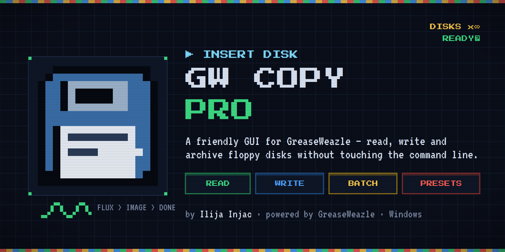

---

## Table of Contents

1. [About this Handbook](#1-about-this-handbook)
2. [Introduction — GreaseWeazle and GWCopyPro](#2-introduction--greaseweazle-and-gwcopypro)
3. [Requirements and Installation](#3-requirements-and-installation)
4. [First Launch and Quick Start](#4-first-launch-and-quick-start)
5. [The Main Window](#5-the-main-window)
6. [The Device Manager](#6-the-device-manager)
7. [Creating a Job — the New Job Dialog](#7-creating-a-job--the-new-job-dialog)
8. [The Job Panel and the Disk Visualiser](#8-the-job-panel-and-the-disk-visualiser)
9. [Repetitive Mode — Imaging Whole Boxes of Disks](#9-repetitive-mode--imaging-whole-boxes-of-disks)
10. [Job Presets](#10-job-presets)
11. [Settings](#11-settings)
12. [Logging](#12-logging)
13. [Audio and Visual Feedback](#13-audio-and-visual-feedback)
14. [Post-Action Script Cookbook](#14-post-action-script-cookbook)
15. [Troubleshooting and FAQ](#15-troubleshooting-and-faq)
16. [Glossary — Floppy and GreaseWeazle Terminology](#16-glossary--floppy-and-greaseweazle-terminology)
17. [gw.exe Parameter Dictionary](#17-gwexe-parameter-dictionary)
18. [Appendix](#18-appendix)

---

## 1. About this Handbook

This handbook explains every function of **GWCopyPro** in detail. It is written so that
newcomers who have never used a GreaseWeazle before can follow along: every technical term
is explained in the [Glossary](#16-glossary--floppy-and-greaseweazle-terminology), and every
command-line flag of the underlying `gw.exe` tool is described in plain language in the
[gw.exe Parameter Dictionary](#17-gwexe-parameter-dictionary).


---

## 2. Introduction — GreaseWeazle and GWCopyPro

### 2.1 What is a GreaseWeazle?

A [GreaseWeazle](https://github.com/keirf/greaseweazle) is a small, inexpensive open-source
USB device designed by Keir Fraser. You connect it between your PC (via USB) and an ordinary
floppy disk drive (via the classic 34-pin floppy ribbon cable). Unlike a normal USB floppy
drive, the GreaseWeazle does not care about *file systems* or *formats* at all — it records
the **raw magnetic flux** on the disk surface, i.e. the exact stream of magnetic reversals
that the drive head sees.

Because of this, a GreaseWeazle can read and write **virtually any floppy format ever made**:
IBM PC, Amiga, Atari ST, Atari 8-bit, Commodore 64/128, Apple II, Macintosh, MSX, PC-98,
Acorn, and many more — including copy-protected disks, as long as the connected drive is
mechanically compatible (3.5″, 5.25″, or even 8″).

The official software for the GreaseWeazle is a **command-line tool** called `gw.exe`
(the "Greaseweazle host tools"). It is powerful, but it must be operated by typing commands
such as:

```
gw read --device COM3 --format ibm.1440 --tracks=c=0-79:h=0-1 --retries 3 mydisk.img
```

### 2.2 What is GWCopyPro?

**GWCopyPro** is a graphical Windows application that wraps `gw.exe` in a comfortable,
dark-themed user interface. It builds those command lines for you — you click checkboxes
and pick values, and GWCopyPro shows you the exact `gw.exe` command it will run.

Its highlights:

- **Multiple GreaseWeazle devices** at once — each on its own COM port, each usable in parallel.
- **Read and write jobs** with a live, track-by-track colour visualiser.
- **Repetitive mode** for digitising whole boxes of disks: insert, image, swap, repeat — with automatic file numbering.
- **Post-actions**: run programs or scripts automatically after each successful job (checksums, archiving, extraction, conversion…).
- **Presets**: save any job configuration and reload it with two clicks.
- **Detailed logs** for every job.
- English and German user interface.

### 2.3 How the pieces fit together

```
┌────────────┐  USB   ┌──────────────┐  34-pin cable  ┌──────────────┐
│    PC      │◄──────►│ GreaseWeazle │◄──────────────►│ Floppy drive │
│ GWCopyPro  │        │   (COMx)     │                │ + diskette   │
│  └─ gw.exe │        └──────────────┘                └──────────────┘
└────────────┘
```

GWCopyPro never talks to the hardware directly — it always launches `gw.exe`, feeds it the
parameters you chose, and interprets its output live.

---

## 3. Requirements and Installation

### 3.1 What you need

| Component | Details |
|---|---|
| Windows 10 / 11 | 64-bit recommended |
| [.NET 8.0 Desktop Runtime](https://dotnet.microsoft.com/en-us/download/dotnet/8.0) | Required to run GWCopyPro |
| `gw.exe` **v0.24 or newer** | From the official [GreaseWeazle tools package](https://github.com/keirf/greaseweazle/releases) |
| One or more GreaseWeazle devices | Any model (V4, V4.1, F1, F7, …) |
| A floppy drive | 3.5″, 5.25″, or 8″ — with power supply and 34-pin data cable |

> **Important:** GWCopyPro generates the `--tracks=` compound syntax introduced in
> `gw.exe` **v0.24**. Older versions of `gw.exe` that still use `--scyl` / `--ecyl` will
> **not** work with the track selection features.

### 3.2 Installing gw.exe

1. Download the latest *Greaseweazle host tools* ZIP from
   [github.com/keirf/greaseweazle/releases](https://github.com/keirf/greaseweazle/releases).
2. Unpack it to a folder of your choice, e.g. `C:\gw\`.
3. Either add that folder to your Windows `PATH`, **or** point GWCopyPro to the full
   path of `gw.exe` in **⚙ Settings** (see [chapter 11](#11-settings)).

When you plug in a GreaseWeazle for the first time, Windows creates a virtual **COM port**
for it (e.g. `COM3`). You can check which port was assigned in the Windows *Device Manager*
under *Ports (COM & LPT)* — but normally GWCopyPro's auto-detection finds it for you.

### 3.3 Installing GWCopyPro

Unpack (or build) GWCopyPro into any folder. The folder contains:

```
GWCopyPro.exe          the application
icon\favicon.ico       application icon
tools\lsar.exe         bundled archive lister   (The Unarchiver command-line tools)
tools\unar.exe         bundled archive extractor
Logs\                  created automatically — one subfolder per job
```

All user data lives under `%APPDATA%\GreaseWeazleManager\`:

```
%APPDATA%\GreaseWeazleManager\
    settings.json      application settings
    Presets\           your saved .gwpreset files
```

---

## 4. First Launch and Quick Start

1. Connect your GreaseWeazle(s) via USB and connect a floppy drive to the GreaseWeazle.
2. Start **GWCopyPro**. On startup the application automatically scans for GreaseWeazle
   devices ("Scanning for GreaseWeazle devices…" appears in the status bar) and queries
   the firmware version of each device it finds.
3. If your device appears in the **DEVICES** strip with a green pulsing LED — you are ready.
   If not, open **⬡ Devices** and add it manually (see [chapter 6](#6-the-device-manager)).
4. Insert a disk into the drive.
5. Click **▶ New Job**, choose *Read (disk → image)*, pick an image file name (e.g.
   `mydisk.scp`), optionally select a *Disk Format*, and press **▶ Start Job**.
6. Watch the track grid fill up with green cells as `gw.exe` reads the disk,
   cylinder by cylinder.

<!-- SCREENSHOT: images/handbook/04-quickstart.png -->
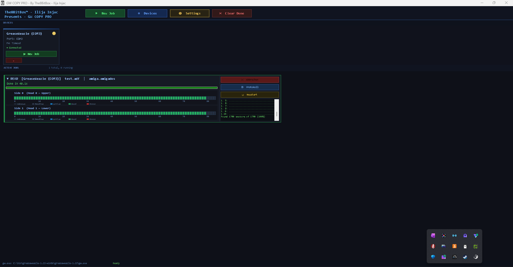

---

## 5. The Main Window

<!-- SCREENSHOT: images/handbook/05-main-window.png -->
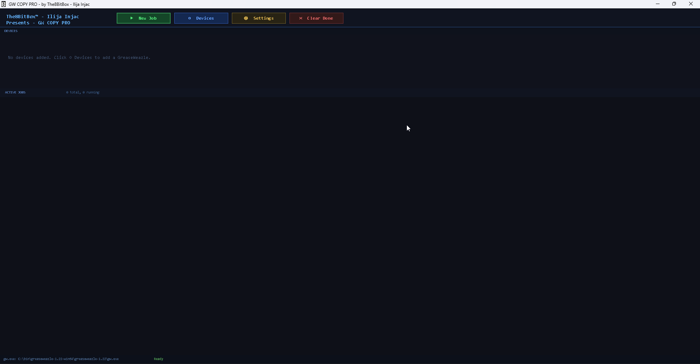

The main window is divided into four areas, from top to bottom:

### 5.1 The toolbar

| Button | Function |
|---|---|
| **▶ New Job** | Opens the [New Job dialog](#7-creating-a-job--the-new-job-dialog) without a pre-selected device. |
| **⬡ Devices** | Opens the [Device Manager](#6-the-device-manager). |
| **⚙ Settings** | Opens the [Settings dialog](#11-settings) (gw.exe path, language). |
| **✕ Clear Done** | Removes all *Completed*, *Error*, and *Cancelled* job panels from the jobs list. Running jobs are never touched. |

### 5.2 The DEVICES strip

A horizontal row of device cards, one per registered GreaseWeazle. Each card shows:

- the **device name** you assigned,
- the **COM port** (`Port: COM3`),
- the **firmware version** (`FW: 1.6`) as reported by `gw.exe info`,
- the **connection status** (● Connected / ● Disconnected),
- a **pulsing LED** — green and pulsing while connected, red when disconnected,
- a **▶ New Job** button that opens the job dialog with this device pre-selected,
- a **×** button that removes the device from the list.

If no devices are registered, a hint text is shown instead:
*"No devices added. Click ⬡ Devices to add a GreaseWeazle."*

<!-- SCREENSHOT: images/handbook/05-device-card.png -->
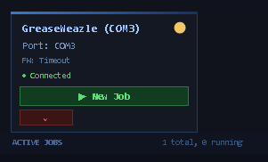

### 5.3 The ACTIVE JOBS area

A scrollable list of [job panels](#8-the-job-panel-and-the-disk-visualiser), one per job.
The header shows a live counter, e.g. `3 total, 1 running`. Jobs remain listed after they
finish (so you can inspect logs or restart them) until you press **✕ Clear Done**.

Multiple jobs may run **simultaneously** on different devices — there is no artificial limit.
Every job runs in its own background thread.

### 5.4 The status bar

- **Left:** the currently configured path to `gw.exe` (`gw.exe: C:\gw\gw.exe`).
- **Right:** the most recent status message (job started/completed, device detection,
  errors). Messages automatically revert to *"Ready"* after 4 seconds.

---

## 6. The Device Manager

Open with **⬡ Devices** in the toolbar.

<!-- SCREENSHOT: images/handbook/06-device-manager.png -->
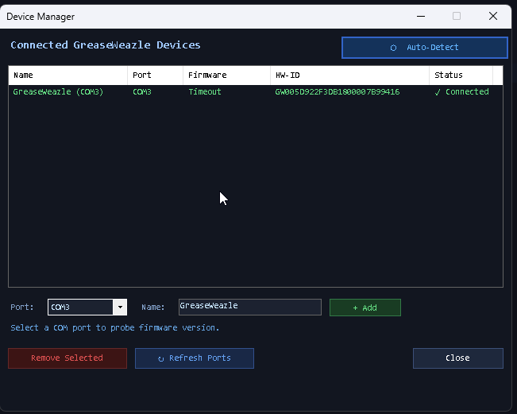

The Device Manager dialog lets you view, add, and remove GreaseWeazle devices **at runtime**
— no application restart needed.

### 6.1 The device list

Columns: **Name**, **Port**, **Firmware**, **HW-ID** (the hardware ID reported by Windows),
and **Status** (✓ Connected / Disconnected). Connected devices are shown in green,
disconnected ones in red.

### 6.2 ⬡ Auto-Detect

Click **⬡ Auto-Detect** to scan the system (via Windows WMI) for connected GreaseWeazle
hardware. For every newly found device, GWCopyPro runs `gw.exe info --device COMx` in the
background to query the firmware version, then adds the device to the list. Devices that are
already registered are skipped ("All detected devices were already registered.").

### 6.3 Adding a device manually

If auto-detection does not find your device (e.g. unusual USB-serial adapter):

1. Select the **Port** from the drop-down (use **↻ Refresh Ports** if your port is missing).
   As soon as you select a port, GWCopyPro probes it and shows the firmware result
   (`COM3 → Firmware: 1.6`).
2. Enter a friendly **Name** (e.g. "GW #1 — 3.5 inch drive").
3. Click **+ Add**.

### 6.4 Removing a device

Select the device row and click **Remove Selected**. This only removes it from GWCopyPro's
list — nothing happens to the hardware.

Click **Close** to return to the main window; the device strip refreshes automatically.

---

## 7. Creating a Job — the New Job Dialog

Open with **▶ New Job** (toolbar or device card). This is the heart of GWCopyPro: five tabs
cover every relevant `gw.exe` option, and a **live command preview** at the bottom of the
dialog always shows the exact command line that will be executed, e.g.:

```
gw.exe read --device COM3 --format ibm.1440 --tracks=c=0-79:h=0-1 --retries 3 "C:\Images\disk1.img"
```

The preview updates instantly as you change any control — a great way to *learn* the
`gw.exe` syntax while using the GUI.

At the bottom of the dialog you also find:

| Button | Function |
|---|---|
| **💾 Save Preset** | Saves the complete current dialog state to a `.gwpreset` file ([chapter 10](#10-job-presets)). |
| **📂 Load Preset** | Loads a `.gwpreset` file and fills all controls from it. |
| **▶ Start Job** | Validates the input and starts the job. |
| **Cancel** | Closes the dialog without starting anything. |

> **Validation:** If you are *not* using Repetitive mode, an image file must be specified —
> otherwise the dialog shows *"Please specify an image file."* and stays open.

### 7.1 Tab "Main Settings"
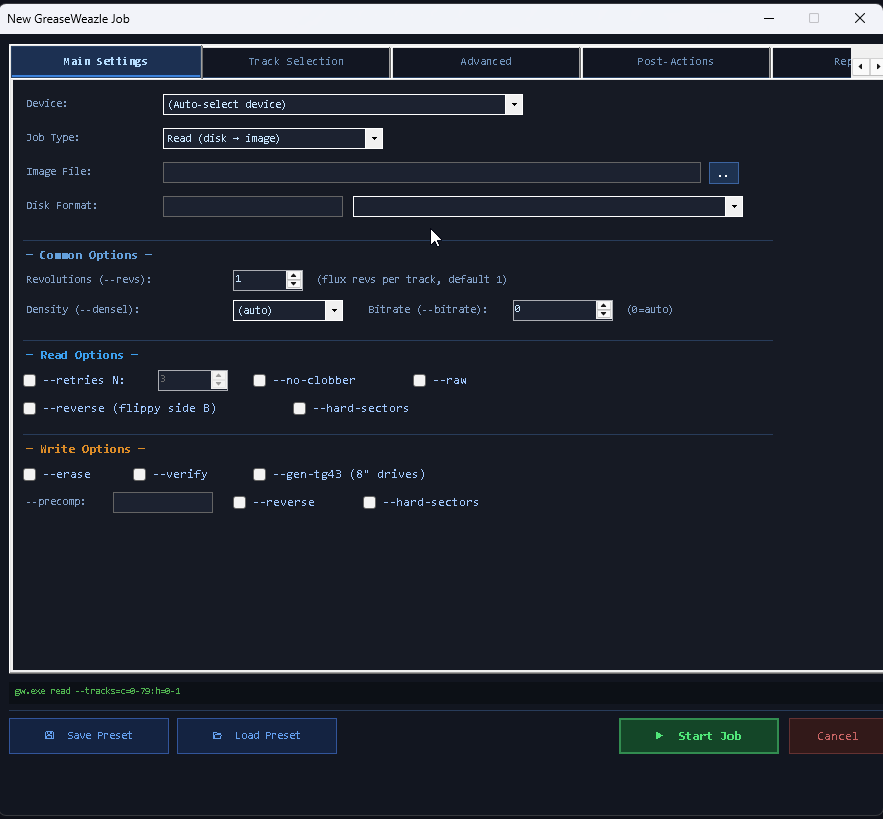
<!-- SCREENSHOT: images/handbook/07-tab-main.png -->

#### Device

Selects which GreaseWeazle runs the job. `(Auto-select device)` lets `gw.exe` pick a device
itself (fine if only one is connected). Selecting a specific device emits
`--device COMx`.

#### Job Type

- **Read (disk → image)** — reads a physical floppy and saves it as an image file
  (`gw.exe read …`).
- **Write (image → disk)** — writes an existing image file onto a physical floppy
  (`gw.exe write …`).

The choice controls which option sections apply (Read Options vs. Write Options) and
whether the file browser opens a *Save* dialog (read) or an *Open* dialog (write).

#### Image File

The full path of the disk image to create (read) or to write (write). The **…** button
opens a file dialog. Supported types in the browser: `*.scp`, `*.hfe`, `*.img`, `*.adf`
(and `*.ipf` for writing). See the [Glossary](#16-glossary--floppy-and-greaseweazle-terminology)
for what each type means.

**Rule of thumb:**
- For *archival* or *unknown/protected* disks: read to **`.scp`** (raw flux — preserves everything).
- For *known standard formats* you want to use in emulators: choose a *Disk Format* and read
  straight to **`.img`** (PC), **`.adf`** (Amiga), **`.st`**/**`.img`** (Atari ST) etc.

#### Disk Format

Corresponds to `--format`. Either type a format name directly into the text box, or pick
one from the quick-select drop-down, which fills the text box for you. The list includes,
among others:

| Family | Formats |
|---|---|
| IBM PC | `ibm.1440`, `ibm.720`, `ibm.1200`, `ibm.360`, `ibm.180`, `ibm.320`, `ibm.800`, `ibm.2880` |
| Amiga | `amiga.amigados`, `amiga.amigados-hd` |
| Atari ST | `atarist.360`, `atarist.400`, `atarist.720`, `atarist.800` |
| Atari 8-bit | `atari.90`, `atari.130`, `atari.180`, `atari.360` |
| Commodore | `commodore.1541`, `commodore.1571`, `commodore.1581` |
| Apple / Mac | `apple2.525.ss.sd.35`, `apple2.525.ss.sd.40`, `mac.400`, `mac.800` |
| MSX | `msx.1`, `msx.2` |
| NEC PC-98 | `pc98.2hd`, `pc98.2dd`, `pc98.2d` |
| Acorn | `acorn.adfs.s/m/l/d/e/f` |
| DEC | `dec.rx50`, `dec.rx33` |
| Ensoniq | `ensoniq.mirage`, `ensoniq.esq1` |
| Other | `gem.1`, `dragon.40`, `coco.35`, `zx.trdos.ds80` |

Leave the field **empty** to omit `--format` entirely (raw flux operation — typical when
reading to `.scp`). The full list your gw.exe supports can be printed with
`gw.exe read --help` or found in the GreaseWeazle wiki.

#### Common Options

| Control | gw.exe flag | Meaning |
|---|---|---|
| **Revolutions** | `--revs N` | How many full disk revolutions of flux are captured per track. Default 1; higher values (2–5) give the decoder more chances to recover weak or damaged sectors and are needed for some copy-protection analysis. |
| **Density** | `--densel hd/dd/ed` | Overrides the density-select line to the drive. `(auto)` = let gw.exe decide. See *Density* in the glossary. |
| **Bitrate** | `--bitrate N` | Forces a specific data rate in kbit/s. `0` = auto-detect (recommended). |

#### Read Options (only used for Read jobs)

| Control | gw.exe flag | Meaning |
|---|---|---|
| **--retries N** | `--retries N` | Re-read a track up to N extra times when bad sectors are detected. Enable the checkbox and set the count (default 3). |
| **--no-clobber** | `--no-clobber` | Do not overwrite tracks that already exist in the output image — useful for *resuming* a partially completed read. |
| **--raw** | `--raw` | Capture raw flux without decoding it through the format codec. |
| **--reverse (flippy side B)** | `--reverse` | Reverses the track data — used when reading side B of a "flippy" disk in a flippy-modified drive. |
| **--hard-sectors** | `--hard-sectors` | Enables support for hard-sectored disks (multiple index holes). |

#### Write Options (only used for Write jobs)

| Control | gw.exe flag | Meaning |
|---|---|---|
| **--erase** | `--erase` | Erases each track before writing — recommended when the target disk previously held a different (especially higher-density) format. |
| **--verify** | `--verify` | Reads each track back after writing and compares — strongly recommended for important disks. |
| **--gen-tg43 (8″ drives)** | `--gen-tg43` | Generates the /TG43 ("Track Greater than 43") signal needed by some 8″ drives to reduce write current on inner tracks. |
| **--precomp** | `--precomp N` | Write precompensation in microseconds — shifts flux transitions slightly to counteract magnetic "bit shift" on inner tracks. Leave empty for default. |
| **--reverse** | `--reverse` | As above, for writing flippy side B. |
| **--hard-sectors** | `--hard-sectors` | As above, for hard-sectored media. |

### 7.2 Tab "Track Selection"

<!-- SCREENSHOT: images/handbook/07-tab-tracks.png -->
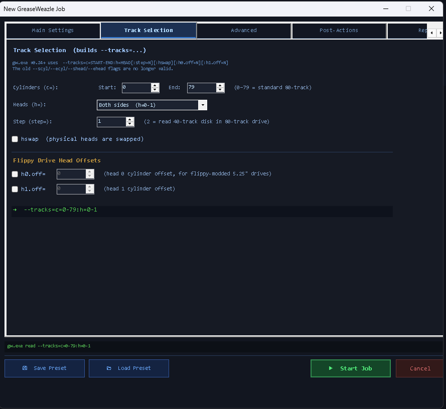

This tab builds the compound `--tracks=` specifier introduced in `gw.exe` v0.24:

```
--tracks=c=START-END:h=HEAD[:step=N][:hswap][:h0.off=N][:h1.off=N]
```

> The old flags `--scyl`, `--ecyl`, `--shead`, `--ehead`, `--single-sided` were **removed**
> in v0.24 and are never generated by GWCopyPro.

A green preview line at the bottom of the tab (e.g. `→ c=0-79:h=0-1`) always shows the
resulting specifier. When everything is at its default, GWCopyPro omits `--tracks=`
entirely and `gw.exe` processes the full disk on both sides.

| Control | Spec component | Meaning |
|---|---|---|
| **Cylinders Start / End** | `c=0-79` | First and last cylinder to process (inclusive). 0–79 is a standard 80-track disk; 0–39 for 40-track (5.25″ DD) disks; up to 83 for "overdumps". |
| **Heads** | `h=0-1`, `h=0`, `h=1` | *Both sides*, *Head 0 only* (bottom side), or *Head 1 only* (top side). Single-sided formats need only head 0. |
| **Step** | `step=2` | Physical head steps per logical cylinder. **`step=2` is the classic trick for reading a 40-track disk in an 80-track drive** — the drive steps twice per data track. |
| **hswap** | `hswap` | Swaps the meaning of head 0 and head 1 — for drives with physically swapped head wiring. |
| **h0.off= / h1.off=** | `h0.off=N` / `h1.off=N` | Cylinder offset per head (−9…+9), used with **flippy-modified 5.25″ drives** where one head is physically offset by a few cylinders. Enable the checkbox to activate. |

### 7.3 Tab "Advanced"

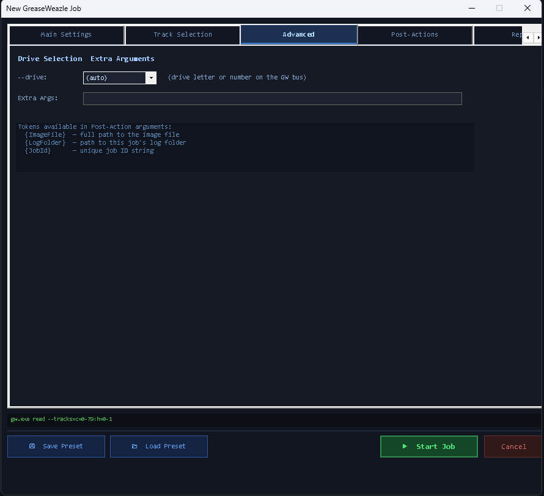

| Control | Meaning |
|---|---|
| **--drive** | Which drive on the GreaseWeazle's floppy bus to use: `a`/`b` (IBM-style twisted cable) or `0`–`3` (Shugart-style straight cable). `(auto)` omits the flag and uses gw.exe's default (drive 0 / A). |
| **Extra Args** | A free-text field appended **verbatim** to the end of the command line, before the image file. Use it for any `gw.exe` option that has no dedicated control, e.g. `--fake-index=200ms`, `--dd 0`, `--seek-retries 5`, or format-specific options like `--adjust-speed`. |

The tab also lists the tokens available in post-action arguments (see next section).

### 7.4 Tab "Post-Actions"

<!-- SCREENSHOT: images/handbook/07-tab-postactions.png -->
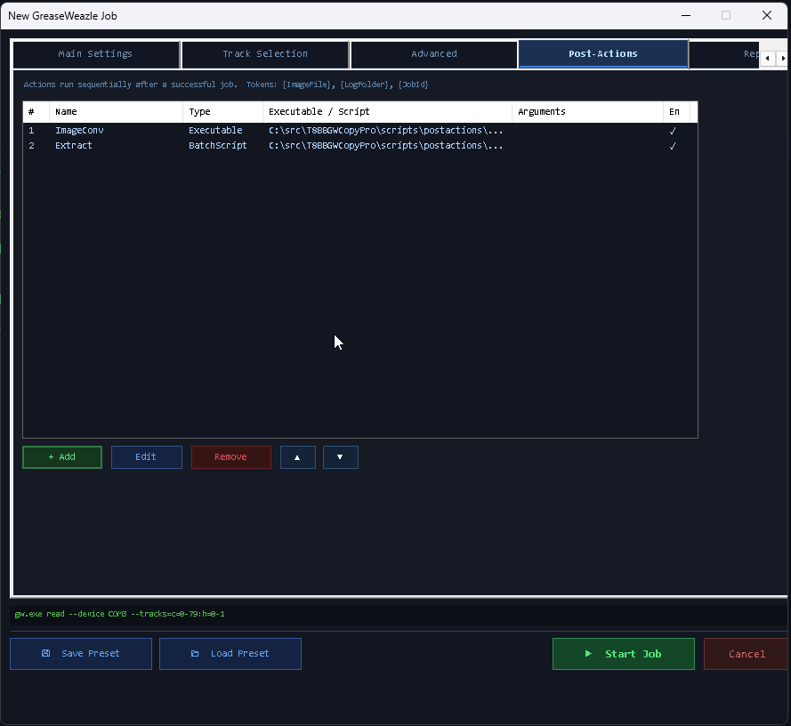

Post-actions are programs or scripts that GWCopyPro runs **automatically and sequentially
after each successful job** (and, in repetitive mode, after **each successful disk**).
Failed or cancelled jobs do **not** trigger post-actions.

Typical uses: checksum generation, validation, zipping, copying to a NAS, converting flux
images to sector images, extracting archives — ready-made scripts for all of these are in
[chapter 14](#14-post-action-script-cookbook).

#### The action list

Columns: **#** (execution order), **Name**, **Type**, **Executable / Script**,
**Arguments**, **En** (enabled ✓ / disabled —).

| Button | Function |
|---|---|
| **+ Add** | Opens the Post-Action editor for a new action. |
| **Edit** | Edits the selected action. |
| **Remove** | Deletes the selected action. |
| **▲ / ▼** | Moves the selected action up/down in the execution order. |

#### The Post-Action editor

<!-- SCREENSHOT: images/handbook/07-postaction-editor.png -->
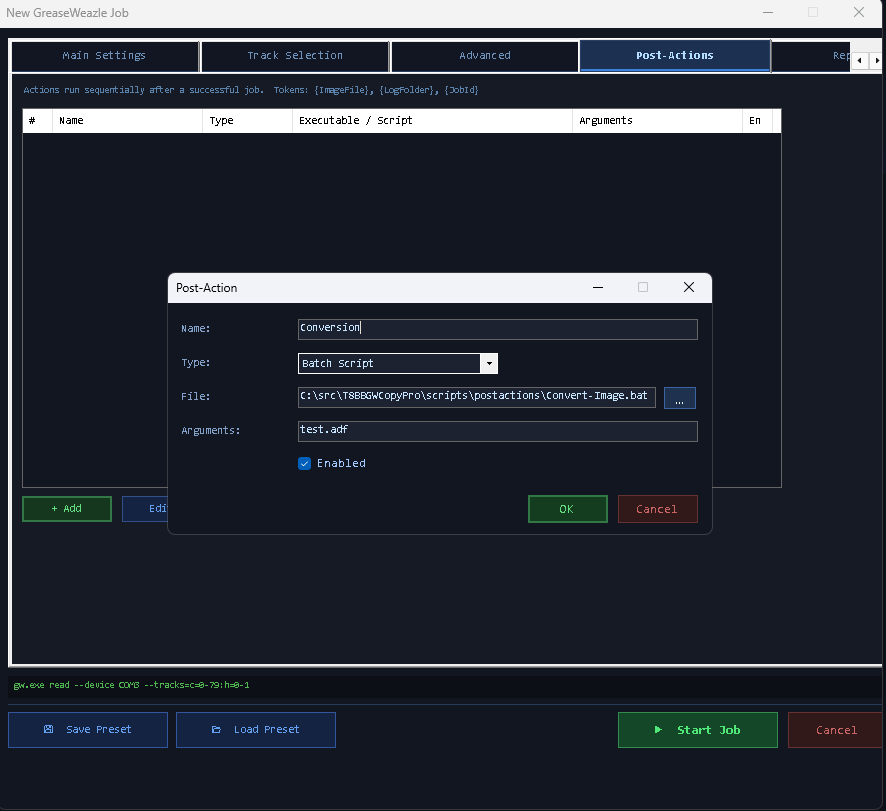

| Field | Meaning |
|---|---|
| **Name** | Display name in the list (e.g. "Validate image"). |
| **Type** | How the action is launched — see table below. |
| **File** | Path to the `.exe`, `.bat`, or `.ps1` file. |
| **Arguments** | Argument string; may contain tokens (see below). |
| **Enabled** | Unchecking skips the action without deleting it. |

| Type | How it is executed |
|---|---|
| **Executable** | `yourfile.exe <arguments>` — called directly. |
| **Batch Script** | `cmd.exe /c "yourscript.bat" <arguments>` |
| **PowerShell Script** | `powershell.exe -NoProfile -ExecutionPolicy Bypass -File "yourscript.ps1" <arguments>` |

#### Tokens

The following tokens in the *Arguments* field are replaced at runtime:

| Token | Expands to |
|---|---|
| `{ImageFile}` | Full path of the disk image the job just produced/used. |
| `{LogFolder}` | Full path of the job's log folder. |
| `{JobId}` | The unique 8-character job ID. |
| `{DiskIndex}` | The current disk number (repetitive mode; `1` otherwise). |

> **Always put quotes around path tokens** — e.g. `"{ImageFile}"` — otherwise paths that
> contain spaces will break the argument parsing of your script.

All output (stdout and stderr) of every post-action is appended to the job's
`gw_output.log`, together with the action's exit code — so you can always verify what
happened.

### 7.5 Tab "Repetitive"

Described in detail in [chapter 9](#9-repetitive-mode--imaging-whole-boxes-of-disks).
This tab also contains the **Preset Name** field used when saving presets.

---

## 8. The Job Panel and the Disk Visualiser

Every started job gets its own panel in the ACTIVE JOBS area.

<!-- SCREENSHOT: images/handbook/08-job-panel.png -->
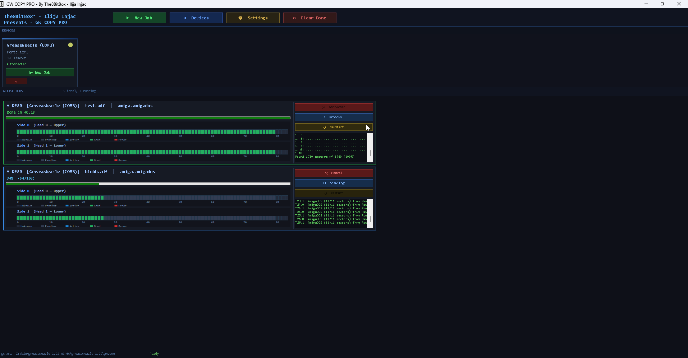

### 8.1 Panel contents

- **Title line** — job type, image file name, device.
- **Status line** — e.g. `45% (72/160)`, or in repetitive mode `Disk #3 45% (72/160)`;
  after completion `Done in 92.4s`, on failure `Error: gw.exe exited with code 1`.
- **Progress bar** — overall percentage of tracks completed.
- **Two track grids** — *Side 0 (Head 0 — Upper)* and *Side 1 (Head 1 — Lower)*, each an
  84-cell bar, one cell per cylinder.
- **Live log pane** — the most recent `gw.exe` output lines, scrolling in real time.
- **Buttons:**

| Button | Function |
|---|---|
| **✕ Cancel** | Cancels this job: the `gw.exe` process (and its children) is terminated and the job is marked *Cancelled*. |
| **📄 View Log** | Opens the job's log folder in Windows Explorer (or the log file in Notepad if only the file exists). |
| **↺ Restart** | Available once the job has finished — re-opens the New Job dialog pre-filled with this job's exact configuration (from its preset snapshot). |

### 8.2 Cell colours

| Colour | Status | Meaning |
|---|---|---|
| Dark grey | Unknown | Not part of the selected track range / not started. |
| Mid grey | Pending | Queued, not yet processed. |
| **Blue** | Reading/Writing | Currently being processed. |
| **Green** | Good | Track finished successfully. |
| **Red** | Error | gw.exe reported an error on this track (bad sectors, etc.). |

The cells are driven by parsing `gw.exe` output lines such as `T12.0: ok` or
`Cyl 12, Head 0: reading`. For gw.exe versions with different output wording, a fallback
parser tracks `n/m` progress fractions so the progress bar keeps moving even if individual
cells cannot be attributed.

> A few **red cells** do not necessarily mean a failed job: if `gw.exe` exits with code 0,
> the job is *Completed* — red cells then mark tracks that had read errors despite retries.
> Check the log for details and consider re-reading with more `--retries` or `--revs`.

---

## 9. Repetitive Mode — Imaging Whole Boxes of Disks

Repetitive mode is made for bulk digitisation sessions: you configure a job **once**, and
GWCopyPro loops it disk after disk, numbering the files automatically.

### 9.1 Configuration (tab "Repetitive")

<!-- SCREENSHOT: images/handbook/09-tab-repeat.png -->
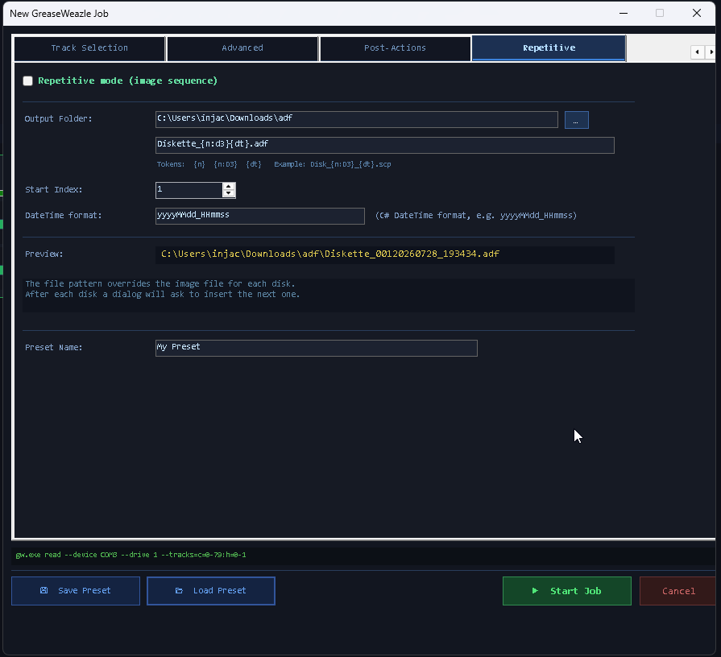

1. Check **Repetitive mode (image sequence)**.
2. Choose an **Output Folder** (leave empty to use the image file's folder; if neither is
   set, the Desktop is used).
3. Enter a **File Pattern** using tokens:

| Token | Meaning | Example (`Disk_{n:D3}_{dt}.scp`, disk 7) |
|---|---|---|
| `{n}` | Disk counter as plain number | `Disk_7_….scp` |
| `{n:D3}` | Counter with .NET format (`D3` = 3 digits, zero-padded) | `Disk_007_….scp` |
| `{dt}` | Timestamp using the *DateTime format* field | `Disk_007_20260728_143022.scp` |

4. Set the **Start Index** (first counter value, default 1) and, if desired, adjust the
   **DateTime format** (a C# `DateTime` format string, default `yyyyMMdd_HHmmss`).
5. The **Preview** line shows exactly what the first file will be called.

> The file pattern **overrides** the *Image File* field for each disk. If the pattern
> contains no token at all, repetitive mode is not engaged and a normal single job runs.

### 9.2 The loop

1. The job runs for disk #1 exactly like a normal job (including post-actions).
2. When the disk completes, the **Next Disk dialog** appears:

<!-- SCREENSHOT: images/handbook/09-next-disk.png -->
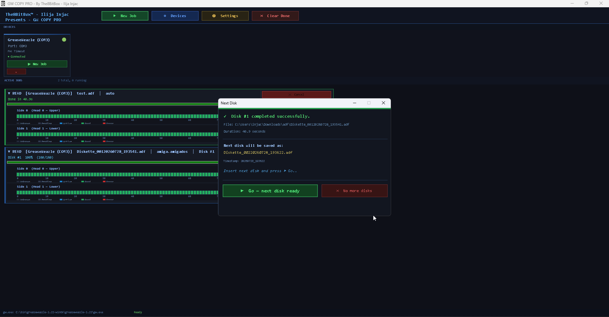

   - `✓ Disk #3 completed successfully.` — with the written file name and duration,
   - the file name the **next** disk will get,
   - a pulsing prompt: *"Insert next disk and press ▶ Go"*.

3. Swap the disk, press **▶ Go — next disk ready** — the counter increments and the next
   disk is imaged. Press **✕ No more disks** to end the session; the job is then marked
   *Completed* with a summary (`Done — 12 disk(s) in …`).

The track grid resets for every disk, and each disk gets its **own log folder**
(`…_disk1`, `…_disk2`, …). Post-actions run after **every** disk, with `{DiskIndex}`
carrying the current number — ideal for per-disk validation or archiving.

---

## 10. Job Presets

A preset stores **everything** in the New Job dialog: device, job type, format, all flags,
track selection, post-actions, and the complete repetitive configuration.

- **💾 Save Preset** (New Job dialog) — writes a JSON file with extension `.gwpreset`,
  by default into `%APPDATA%\GreaseWeazleManager\Presets\`. The file name is derived from
  the **Preset Name** field on the *Repetitive* tab.
- **📂 Load Preset** — loads a `.gwpreset` file and fills every control from it.
- **↺ Restart** (job panel) — every started job keeps an internal snapshot of its
  configuration; Restart re-opens the dialog pre-filled with it, even if you never saved
  a preset file.

Because presets are plain JSON, you can inspect, back up, or share them freely.

**Example workflow:** create presets "Amiga DD → ADF", "PC 1.44MB → IMG", and
"Unknown disk → SCP raw archive (3 revs)" once — from then on any imaging session starts
with two clicks.

---

## 11. Settings

Open with **⚙ Settings**.

<!-- SCREENSHOT: images/handbook/11-settings.png -->
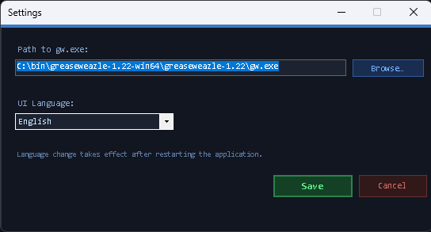

| Setting | Meaning |
|---|---|
| **Path to gw.exe** | Full path to your `gw.exe`. Default is plain `gw.exe`, which works when the gw tools folder is on your `PATH`. Use **Browse…** to pick the file. |
| **UI Language** | English or Deutsch. The change is applied on **Save**; some elements only refresh fully after restarting the application. |

Settings are stored in `%APPDATA%\GreaseWeazleManager\settings.json` and persist across
sessions.

---

## 12. Logging

Every job writes a complete log:

```
<application folder>\Logs\
    Job_Read_a1b2c3d4_20260728_143022\          ← one folder per job
        gw_output.log
    Job_Read_e5f6a7b8_20260728_150001_disk1\    ← repetitive mode: one folder per disk
    Job_Read_e5f6a7b8_20260728_150001_disk2\
```

`gw_output.log` contains:

1. A header with job type, device, disk number, the **full gw.exe command line**, and the
   start time.
2. Every stdout line of `gw.exe`, live; stderr lines prefixed `[ERR]`.
3. The completion marker (`[COMPLETED]`, `[CANCELLED]`, `[ERROR] Exit code: N`, or
   `[EXCEPTION] …`).
4. A `=== Post-Actions ===` section with each action's command, its output, and its exit
   code (`[ACTION] Exit: 0`).

The **📄 View Log** button on the job panel takes you straight to the folder.

> **Tip:** the log always contains the exact command line — copy it into a terminal to
> reproduce or fine-tune a run manually.

---

## 13. Audio and Visual Feedback

GWCopyPro signals important events audibly (useful when you are sorting disks and not
watching the screen):

| Event | Sound | Visual |
|---|---|---|
| Job started | Two ascending beeps | Status bar message |
| Job / disk completed | Three ascending beeps | Green status message, green track cells |
| Job error | Three descending beeps | Red status message + the main window background flashes red four times |
| Track error | — | Red cell in the visualiser |

---

## 14. Post-Action Script Cookbook

This chapter contains **ready-to-use scripts** for the Post-Actions tab. Copies of all
scripts are shipped in the repository folder [`scripts/postactions/`](../scripts/postactions/)
— copy them anywhere you like (e.g. next to `GWCopyPro.exe` in a `scripts\` folder) and
reference them from the Post-Action editor.

**General configuration pattern** (Post-Action editor):

| Field | Value |
|---|---|
| Type | *PowerShell Script* (for `.ps1`) or *Batch Script* (for `.bat`) |
| File | full path to the script |
| Arguments | as given per recipe below — **keep the quotes around tokens!** |

All scripts write their progress to stdout, which lands in the job's `gw_output.log`.

### 14.1 Extracting archives with the bundled lsar.exe / unar.exe

GWCopyPro ships the command-line tools of *The Unarchiver* in its `tools\` folder:

- **`lsar.exe`** — *lists* the contents of an archive (zip, rar, 7z, lha/lzh, adz, …).
- **`unar.exe`** — *extracts* archives of nearly any type.

This is handy when your disk images (or the software you want to write to disk) arrive
inside archives: `.zip`, `.rar`, `.lha` (very common in the Amiga world), `.7z`, and even
`.adz` (gzipped ADF).

Basic manual usage:

```
lsar.exe "C:\Downloads\games.rar"                         List contents
unar.exe -force-overwrite -o "C:\Extracted" "games.rar"   Extract everything to C:\Extracted
```

#### Script: `Extract-Archive.ps1`

Lists an archive with `lsar.exe`, extracts it with `unar.exe`, and reports every disk
image (`.adf`, `.scp`, `.img`, `.st`, `.hfe`, `.ipf`, …) it finds:

```powershell
<#  Extract-Archive.ps1
    Lists an archive with lsar.exe and extracts it with unar.exe.
    Reports all disk images found after extraction.

    Post-Action setup:
      Type:      PowerShell Script
      File:      C:\...\scripts\postactions\Extract-Archive.ps1
      Arguments: -Archive "{ImageFile}" -Destination "D:\Extracted"
#>
param(
    [Parameter(Mandatory = $true)][string]$Archive,
    [string]$Destination = "",
    [string]$ToolsDir    = ""
)

$ErrorActionPreference = "Stop"

# Locate lsar/unar: explicit -ToolsDir, then tools\ next to this script's
# grandparent (repo layout), then tools\ next to GWCopyPro.exe, then PATH.
function Find-Tool([string]$name) {
    $candidates = @()
    if ($ToolsDir) { $candidates += (Join-Path $ToolsDir $name) }
    $candidates += (Join-Path $PSScriptRoot "..\..\tools\$name")
    $candidates += (Join-Path (Split-Path $PSScriptRoot -Parent) "tools\$name")
    $candidates += (Join-Path (Get-Location) "tools\$name")
    foreach ($c in $candidates) { if (Test-Path $c) { return (Resolve-Path $c).Path } }
    $cmd = Get-Command $name -ErrorAction SilentlyContinue
    if ($cmd) { return $cmd.Source }
    throw "$name not found. Pass -ToolsDir <folder containing lsar.exe/unar.exe>."
}

$lsar = Find-Tool "lsar.exe"
$unar = Find-Tool "unar.exe"

if (-not (Test-Path $Archive)) { throw "Archive not found: $Archive" }

if (-not $Destination) {
    $Destination = Join-Path (Split-Path $Archive -Parent) `
                   ([IO.Path]::GetFileNameWithoutExtension($Archive))
}
New-Item -ItemType Directory -Force -Path $Destination | Out-Null

Write-Output "=== Archive contents ($([IO.Path]::GetFileName($Archive))) ==="
& $lsar $Archive

Write-Output "=== Extracting to $Destination ==="
& $unar -force-overwrite -output-directory $Destination $Archive
if ($LASTEXITCODE -ne 0) { throw "unar.exe failed with exit code $LASTEXITCODE" }

$imageExt = ".adf", ".adz", ".scp", ".img", ".ima", ".st", ".hfe", ".ipf", ".d64", ".dsk"
$images = Get-ChildItem $Destination -Recurse -File |
          Where-Object { $imageExt -contains $_.Extension.ToLower() }

Write-Output "=== Disk images found: $($images.Count) ==="
$images | ForEach-Object { Write-Output "  $($_.FullName)  ($($_.Length) bytes)" }
exit 0
```

Typical uses:

- **Preparing write jobs:** you keep `.lha`/`.zip` archives of Amiga software; run the
  script manually (or as a post-action of a "dummy" job) to unpack the `.adf` files, then
  write them with a Write job.
- **Post-processing downloads dropped into the output folder.**

> **Note on `unrar.exe`:** the user-requested `unrar.exe` is *not* bundled — it is the free
> command-line extractor from the WinRAR makers ([rarlab.com](https://www.rarlab.com/rar_add.htm)).
> `unar.exe` already extracts RAR archives, so you normally don't need it. If you prefer
> unrar anyway, see the next recipe.

#### Script: `Extract-Rar.bat` (using unrar.exe)

```bat
@echo off
REM  Extract-Rar.bat — extracts a RAR archive with unrar.exe
REM
REM  Requires unrar.exe (https://www.rarlab.com/rar_add.htm) — either on PATH
REM  or adjust the UNRAR variable below.
REM
REM  Post-Action setup:
REM    Type:      Batch Script
REM    File:      C:\...\scripts\postactions\Extract-Rar.bat
REM    Arguments: "{ImageFile}" "D:\Extracted"
REM
set "UNRAR=unrar.exe"

if "%~1"=="" (
    echo Usage: Extract-Rar.bat archive.rar [destination]
    exit /b 2
)

set "DEST=%~2"
if "%DEST%"=="" set "DEST=%~dp1%~n1"
if not exist "%DEST%" mkdir "%DEST%"

echo === Listing %~nx1 ===
"%UNRAR%" l "%~1"

echo === Extracting to %DEST% ===
"%UNRAR%" x -y -o+ "%~1" "%DEST%\"
if errorlevel 1 (
    echo [ERROR] unrar failed with exit code %errorlevel%
    exit /b 1
)
echo Done.
exit /b 0
```

### 14.2 Zipping images and output folders

#### Script: `Zip-Image.ps1` — compress the image the job just produced

```powershell
<#  Zip-Image.ps1
    Compresses the finished disk image into a .zip placed next to it.

    Post-Action setup:
      Type:      PowerShell Script
      File:      C:\...\scripts\postactions\Zip-Image.ps1
      Arguments: -ImageFile "{ImageFile}"
      Optional:  add  -DeleteOriginal  to remove the uncompressed image afterwards.
#>
param(
    [Parameter(Mandatory = $true)][string]$ImageFile,
    [switch]$DeleteOriginal
)

$ErrorActionPreference = "Stop"
if (-not (Test-Path $ImageFile)) { throw "Image not found: $ImageFile" }

$zip = [IO.Path]::ChangeExtension($ImageFile, ".zip")
Compress-Archive -Path $ImageFile -DestinationPath $zip -CompressionLevel Optimal -Force

$src = (Get-Item $ImageFile).Length
$dst = (Get-Item $zip).Length
Write-Output ("Zipped {0} -> {1}  ({2:N0} -> {3:N0} bytes, {4:P0} of original)" -f `
    [IO.Path]::GetFileName($ImageFile), [IO.Path]::GetFileName($zip), $src, $dst, ($dst / $src))

if ($DeleteOriginal) {
    Remove-Item $ImageFile
    Write-Output "Original image deleted."
}
exit 0
```

#### Script: `Zip-OutputFolder.ps1` — archive the whole output directory

Perfect as the *last* action of a repetitive session, or run manually after a batch:

```powershell
<#  Zip-OutputFolder.ps1
    Compresses ALL disk images in a folder into one timestamped zip archive.

    Post-Action setup:
      Type:      PowerShell Script
      File:      C:\...\scripts\postactions\Zip-OutputFolder.ps1
      Arguments: -Folder "D:\FloppyImages" 
      (or:       -Folder "{ImageFile}"  to use the folder the image lives in)
#>
param(
    [Parameter(Mandatory = $true)][string]$Folder,
    [string]$ZipPath = ""
)

$ErrorActionPreference = "Stop"

# Accept either a folder or a file (then its parent folder is used)
if (Test-Path $Folder -PathType Leaf) { $Folder = Split-Path $Folder -Parent }
if (-not (Test-Path $Folder)) { throw "Folder not found: $Folder" }

if (-not $ZipPath) {
    $stamp   = Get-Date -Format "yyyyMMdd_HHmmss"
    $ZipPath = Join-Path $Folder ("Images_{0}.zip" -f $stamp)
}

$imageExt = ".adf", ".adz", ".scp", ".img", ".ima", ".st", ".hfe", ".ipf", ".d64", ".dsk"
$files = Get-ChildItem $Folder -File |
         Where-Object { $imageExt -contains $_.Extension.ToLower() }

if ($files.Count -eq 0) { Write-Output "No disk images found in $Folder - nothing to do."; exit 0 }

Compress-Archive -Path $files.FullName -DestinationPath $ZipPath -CompressionLevel Optimal -Force
Write-Output ("Archived {0} image(s) into {1}" -f $files.Count, $ZipPath)
exit 0
```

### 14.3 Validating images

#### Script: `Validate-Image.ps1` — sanity check + SHA-256 checksum

Checks that the image exists, is not empty, has a plausible size for its type, and writes
a `.sha256` checksum sidecar file for long-term integrity verification:

```powershell
<#  Validate-Image.ps1
    Validates a freshly created disk image:
      1. File exists and is not zero bytes.
      2. File size matches the expected size for known image types (warning only).
      3. Writes a SHA-256 checksum to "<image>.sha256".
    Exit code 0 = OK, 1 = validation failed (visible in gw_output.log).

    Post-Action setup:
      Type:      PowerShell Script
      File:      C:\...\scripts\postactions\Validate-Image.ps1
      Arguments: -ImageFile "{ImageFile}"
#>
param(
    [Parameter(Mandatory = $true)][string]$ImageFile
)

$ErrorActionPreference = "Stop"

if (-not (Test-Path $ImageFile)) {
    Write-Output "[FAIL] Image file does not exist: $ImageFile"
    exit 1
}

$item = Get-Item $ImageFile
if ($item.Length -eq 0) {
    Write-Output "[FAIL] Image file is empty (0 bytes): $ImageFile"
    exit 1
}

# Expected sizes (bytes) for common sector-image types. Flux formats (.scp/.hfe)
# have variable sizes and are only checked for non-emptiness.
$expected = @{
    ".adf" = @(901120, 1802240)                              # Amiga DD / HD
    ".img" = @(184320, 327680, 368640, 737280, 819200,
               1228800, 1474560, 2949120)                    # common PC sizes
    ".ima" = @(737280, 1474560)
    ".st"  = @(368640, 409600, 737280, 819200)               # Atari ST
    ".d64" = @(174848, 175531)                               # C64 1541 (w/o + with error info)
}

$ext = $item.Extension.ToLower()
if ($expected.ContainsKey($ext)) {
    if ($expected[$ext] -contains $item.Length) {
        Write-Output ("[OK]   Size check passed: {0:N0} bytes is valid for {1}" -f $item.Length, $ext)
    } else {
        Write-Output ("[WARN] Unusual size for {0}: {1:N0} bytes (expected one of: {2})" -f `
            $ext, $item.Length, ($expected[$ext] -join ", "))
    }
} else {
    Write-Output ("[INFO] No size table for {0} - skipping size check ({1:N0} bytes)." -f $ext, $item.Length)
}

$hash = (Get-FileHash $ImageFile -Algorithm SHA256).Hash
$sidecar = "$ImageFile.sha256"
"$hash *$([IO.Path]::GetFileName($ImageFile))" | Out-File -FilePath $sidecar -Encoding ascii
Write-Output "[OK]   SHA-256: $hash"
Write-Output "[OK]   Checksum written to $sidecar"
exit 0
```

> Later, you can verify an image against its sidecar at any time:
> `certutil -hashfile image.adf SHA256` and compare, or use any checksum tool.

### 14.4 Converting flux images to sector images

`gw.exe` itself can convert between image types (`gw convert`). A classic pipeline is:
read everything as raw `.scp` flux for archival, then automatically derive a usable `.adf`
or `.img`:

#### Script: `Convert-Image.bat`

```bat
@echo off
REM  Convert-Image.bat — converts a flux image (e.g. .scp) to a sector image
REM  using "gw.exe convert".
REM
REM  Usage: Convert-Image.bat "image.scp" <format> <target-extension>
REM  Example arguments in the Post-Action editor:
REM      "{ImageFile}" amiga.amigados adf        -> image.adf
REM      "{ImageFile}" ibm.1440 img              -> image.img
REM
REM  Adjust GW below if gw.exe is not on your PATH.
set "GW=gw.exe"

if "%~3"=="" (
    echo Usage: Convert-Image.bat image.scp format target-extension
    exit /b 2
)

echo Converting %~nx1 to %~n1.%3 (format %2) ...
"%GW%" convert --format %2 "%~1" "%~dpn1.%3"
if errorlevel 1 (
    echo [ERROR] gw convert failed with exit code %errorlevel%
    exit /b 1
)
echo Done: %~dpn1.%3
exit /b 0
```

### 14.5 Copying finished images to a backup location

#### Script: `Copy-ToBackup.ps1`

```powershell
<#  Copy-ToBackup.ps1
    Copies the finished image (and its .sha256 sidecar, if present) to a backup
    folder or NAS share, preserving the file name.

    Post-Action setup:
      Type:      PowerShell Script
      File:      C:\...\scripts\postactions\Copy-ToBackup.ps1
      Arguments: -ImageFile "{ImageFile}" -Destination "\\NAS\FloppyArchive"
#>
param(
    [Parameter(Mandatory = $true)][string]$ImageFile,
    [Parameter(Mandatory = $true)][string]$Destination
)

$ErrorActionPreference = "Stop"
if (-not (Test-Path $ImageFile))   { throw "Image not found: $ImageFile" }
New-Item -ItemType Directory -Force -Path $Destination | Out-Null

Copy-Item $ImageFile -Destination $Destination -Force
Write-Output "Copied $([IO.Path]::GetFileName($ImageFile)) -> $Destination"

$sidecar = "$ImageFile.sha256"
if (Test-Path $sidecar) {
    Copy-Item $sidecar -Destination $Destination -Force
    Write-Output "Copied checksum sidecar as well."
}
exit 0
```

### 14.6 A recommended action chain for archival reads

Order matters — actions run top to bottom:

| # | Action | Type | Arguments |
|---|---|---|---|
| 1 | Validate image | PowerShell Script | `-ImageFile "{ImageFile}"` |
| 2 | Convert SCP → ADF | Batch Script | `"{ImageFile}" amiga.amigados adf` |
| 3 | Zip image | PowerShell Script | `-ImageFile "{ImageFile}"` |
| 4 | Copy to NAS | PowerShell Script | `-ImageFile "{ImageFile}" -Destination "\\NAS\FloppyArchive"` |

---

## 15. Troubleshooting and FAQ

**No devices are found on startup.**
Check the USB cable and try **⬡ Devices → ⬡ Auto-Detect**. Verify in the Windows Device
Manager that a COM port appears when you plug in the GreaseWeazle. If the port exists but
detection fails, add the device manually by selecting its port.

**"gw.exe exited with code 1" immediately after starting a job.**
Open **📄 View Log** — the first lines usually name the cause: `gw.exe` not found (fix the
path in ⚙ Settings), an unknown `--format` name, a disk that is not inserted, or a drive
that is not responding.

**The command preview shows my option but the disk is read wrongly.**
Read the log: `gw.exe` prints exactly what it did. Common pitfalls: wrong *Disk Format*,
missing `step=2` for 40-track disks in 80-track drives, and forgetting `--densel dd` with
some HD drives reading DD media.

**Red cells appear although the job completes.**
Those tracks had errors despite the retries. Try again with a higher **--retries** count,
more **Revolutions**, after cleaning the disk/drive head — or accept the loss if the disk
is degraded.

**Post-action did not run.**
Post-actions only run after **successful** jobs. Also check the *En* column (enabled ✓)
and the log's `=== Post-Actions ===` section for error output and exit codes.

**Paths with spaces break my script.**
Quote the tokens in the Arguments field: `-ImageFile "{ImageFile}"`.

**Language switch shows a mix of English and German.**
Some UI elements refresh only after an application restart, as noted in the Settings
dialog.

**Can I write-protect against accidental writes?**
Yes — physically: slide the write-protect tab on the disk. The drive hardware then blocks
all writes regardless of software.

---

## 16. Glossary — Floppy and GreaseWeazle Terminology

Ordered roughly from "physical" to "logical".

| Term | Explanation |
|---|---|
| **Flux (magnetic flux)** | The magnetisation pattern on the disk surface. Data is stored as *flux transitions* — points where the magnetic polarity flips. A GreaseWeazle records the precise timing between these transitions, which is why it works with any format. |
| **Flux image** | An image file that stores the raw flux timing (e.g. `.scp`). It preserves *everything*, including copy protection — but emulators mostly want sector images. |
| **Sector image** | An image file that stores only the decoded user data, sector by sector (e.g. `.img`, `.adf`, `.st`). Compact and emulator-friendly, but only possible when the format is known and intact. |
| **Track** | One circular ring of data on one side of the disk. In gw.exe terminology a track is identified by *cylinder* + *head* (e.g. `T12.0` = cylinder 12, head 0). |
| **Cylinder** | All tracks at the same head position across both sides. An 80-track disk has cylinders 0–79. GWCopyPro's `c=` range selects cylinders. |
| **Head / Side** | The read/write head; head 0 = underside, head 1 = top side of the disk. Double-sided disks use both. GWCopyPro's `h=` selects heads. |
| **Sector** | A subdivision of a track (typically 512 bytes on PC disks, 9–18 sectors per track). Sector images are organised this way. |
| **Soft-sectored** | The normal case: sector boundaries are defined by data marks; the disk has a single index hole. |
| **Hard-sectored** | Old media where each sector has its own physical index hole. Needs the `--hard-sectors` flag. |
| **Index hole / index pulse** | A small hole in the disk; a sensor generates one pulse per revolution, marking the "start" of each track. |
| **Revolution** | One full 360° turn of the disk. `--revs` selects how many revolutions of flux are captured per track — more revolutions give the decoder more chances on weak bits. |
| **RPM** | Revolutions per minute — 300 for most drives, 360 for 5.25″ HD drives (and 8″). |
| **TPI (tracks per inch)** | Track density: 48 tpi (40-track 5.25″), 96 tpi (80-track 5.25″), 135 tpi (3.5″). |
| **Double stepping (`step=2`)** | Reading a 40-track (48 tpi) disk in an 80-track (96 tpi) drive: the drive must step *twice* per logical track. |
| **Density (SD/DD/QD/HD/ED)** | Single / Double / Quad / High / Extra-high density — generations of media with increasing capacity (e.g. 3.5″: DD=720KB, HD=1.44MB, ED=2.88MB). Media and recording mode must match. |
| **Density select (densel)** | A signal line telling the drive which density mode to use. `--densel hd/dd/ed` overrides it — occasionally needed when reading DD disks in HD drives. |
| **Bitrate** | The data rate of the recording, e.g. 250 kbit/s (DD) or 500 kbit/s (HD). `--bitrate` can force it; 0 = auto. |
| **FM / MFM / GCR** | Encoding schemes that translate bits into flux transitions. FM (single density, oldest), MFM (most PC/Amiga/Atari formats), GCR (Commodore 1541, old Macintosh). |
| **Flippy disk** | A 5.25″ disk written on both sides by *physically flipping it over* in a single-sided drive (common for C64/Apple II). Reading side B in a PC drive needs tricks: the `--reverse` flag and/or a "flippy-modified" drive with head offsets (`h0.off=` / `h1.off=`). |
| **hswap** | "Head swap" — corrects drives whose two heads are wired in reverse. |
| **Write precompensation (`--precomp`)** | Deliberately shifting flux transitions by fractions of a microsecond when writing inner tracks, to counteract the magnetic drift ("bit shift") that occurs there. |
| **TG43 (`--gen-tg43`)** | "Track Greater than 43" — a signal some 8″ drives need on tracks > 43 to lower the write current. |
| **Write-protect** | The physical tab/notch on a disk. When set, the drive hardware refuses all writes. |
| **Shugart bus** | The classic 34-pin floppy interface. Drives are addressed either as `0–3` (straight cable, Shugart standard) or `a/b` (PC twisted cable) — this is what `--drive` selects. |
| **COM port** | The virtual serial port (e.g. `COM3`) Windows creates for the GreaseWeazle's USB connection — this is what `--device` selects. |
| **Firmware** | The program running *on* the GreaseWeazle board. `gw.exe info` reports its version; `gw.exe update` upgrades it. |
| **SCP (`.scp`)** | *SuperCard Pro* flux image format — the de-facto standard for raw flux archival. |
| **HFE (`.hfe`)** | Flux-level format of the HxC floppy emulator ecosystem — ideal when the target is a hardware floppy emulator (Gotek). |
| **ADF (`.adf`)** | *Amiga Disk File* — sector image of an AmigaDOS disk: 901,120 bytes (DD) or 1,802,240 bytes (HD). |
| **ADZ (`.adz`)** | A gzip-compressed ADF. Extract with `unar.exe` before writing. |
| **IMG / IMA (`.img`)** | Plain sector image, most commonly of PC/MS-DOS disks (e.g. 1,474,560 bytes for 1.44MB). |
| **ST (`.st`)** | Sector image of an Atari ST disk. |
| **IPF (`.ipf`)** | *Interchangeable Preservation Format* by the Software Preservation Society — describes protected disks precisely; GWCopyPro supports it for **writing**. |
| **D64 (`.d64`)** | Sector image of a Commodore 1541 disk (174,848 bytes). |
| **Preset (`.gwpreset`)** | GWCopyPro's own JSON file storing a complete job configuration. |
| **Post-action** | A program/script GWCopyPro runs automatically after a successful job. |

---

## 17. gw.exe Parameter Dictionary

Everything GWCopyPro generates, explained in plain language. The first token is the
**command**:

| Command | Meaning |
|---|---|
| `gw read <options> <image>` | Read a physical disk into an image file. |
| `gw write <options> <image>` | Write an image file onto a physical disk. |

Other useful `gw.exe` commands (not generated by GWCopyPro, but good to know — run them in
a terminal): `gw info` (device/firmware info), `gw convert` (convert image ↔ image),
`gw erase` (bulk-erase a disk), `gw rpm` (measure drive speed), `gw clean` (head-cleaning
cycle with a cleaning disk), `gw seek` (move the head), `gw reset`, `gw update` (firmware
update).

### Parameters generated by GWCopyPro

| Parameter | Used for | Plain-language meaning |
|---|---|---|
| `--device COMx` | read + write | Which GreaseWeazle to use, by its COM port. Omitted = auto-select. |
| `--drive a\|b\|0-3` | read + write | Which floppy drive on the ribbon cable: `a`/`b` for PC-style twisted cables, `0`–`3` for straight Shugart cables. |
| `--format <name>` | read + write | The logical disk format (e.g. `ibm.1440`, `amiga.amigados`). Tells gw.exe how to decode/encode sectors. Omit for raw flux work. |
| `--tracks=<spec>` | read + write | Which tracks to process — see breakdown below. |
| `--revs N` | read | Revolutions of flux captured per track (default 1; more = better recovery of weak data). |
| `--densel hd\|dd\|ed` | read + write | Force the density-select line to high/double/extra density instead of auto. |
| `--bitrate N` | read + write | Force the data rate (kbit/s) instead of auto-detecting. |
| `--retries N` | read | Extra read attempts per track when bad sectors are found. |
| `--no-clobber` | read | Never overwrite tracks already present in the output image (resume support). |
| `--raw` | read | Store raw flux without decoding — even when a format is given. |
| `--reverse` | read + write | Reverse the track data direction — for side B of flippy disks. |
| `--hard-sectors` | read + write | Handle hard-sectored disks (multiple index holes per revolution). |
| `--erase` | write | Erase each track before writing it. |
| `--verify` | write | Read back and compare every written track. |
| `--precomp N` | write | Write precompensation in microseconds. |
| `--gen-tg43` | write | Generate the /TG43 signal for 8″ drives. |

### The `--tracks=` specifier in detail

```
--tracks=c=0-79:h=0-1:step=2:hswap:h0.off=+1:h1.off=-1
         └──┬──┘ └─┬─┘ └──┬──┘ └─┬─┘ └────────┬───────┘
        cylinders heads  double  head    flippy head
        first-last 0/1/  step    swap    cylinder offsets
                   both
```

| Component | Meaning |
|---|---|
| `c=A-B` or `c=N` | Cylinder range (inclusive) or a single cylinder. |
| `h=0-1` / `h=0` / `h=1` | Both heads, or only head 0 / head 1. |
| `step=N` | Physical head steps per logical cylinder (2 = 40-track disk in 80-track drive). |
| `hswap` | Swap the two physical heads. |
| `h0.off=±N` / `h1.off=±N` | Per-head cylinder offset for flippy-modified drives. |

**Removed legacy flags** (pre-v0.24, *never* use with modern gw.exe): `--scyl`, `--ecyl`,
`--shead`, `--ehead`, `--single-sided`. Their function is fully covered by `--tracks=`.

### Worked examples

| Goal | Command line (as shown in GWCopyPro's preview) |
|---|---|
| Archive an unknown disk as raw flux, 3 revolutions | `gw.exe read --device COM3 --revs 3 "disk.scp"` |
| PC 1.44MB disk to IMG with retries | `gw.exe read --device COM3 --format ibm.1440 --retries 3 "disk.img"` |
| Amiga DD disk to ADF | `gw.exe read --device COM3 --format amiga.amigados "game.adf"` |
| 40-track 5.25″ disk in an 80-track drive | `gw.exe read --device COM3 --tracks=c=0-39:h=0-1:step=2 "old.scp"` |
| Side A only (single-sided format) | `gw.exe read --device COM3 --tracks=c=0-79:h=0 "side_a.scp"` |
| Write an ADF back to disk, verified | `gw.exe write --device COM3 --format amiga.amigados --erase --verify "game.adf"` |

---

## 18. Appendix

### 18.1 File and folder reference

| Location | Contents |
|---|---|
| `<app folder>\Logs\Job_<Type>_<ID>_<timestamp>[_diskN]\gw_output.log` | Per-job (per-disk) log. |
| `%APPDATA%\GreaseWeazleManager\settings.json` | Application settings. |
| `%APPDATA%\GreaseWeazleManager\Presets\*.gwpreset` | Saved job presets (JSON). |
| `<app folder>\tools\lsar.exe`, `unar.exe` | Bundled archive tools. |
| `scripts\postactions\*` (repository) | The ready-to-use post-action scripts from chapter 14. |

### 18.2 Useful links

- GreaseWeazle project & downloads: <https://github.com/keirf/greaseweazle>
- GreaseWeazle wiki (drive wiring, supported formats): <https://github.com/keirf/greaseweazle/wiki>
- The Unarchiver command-line tools (lsar/unar): <https://theunarchiver.com/command-line>
- unrar command-line: <https://www.rarlab.com/rar_add.htm>
- SuperCard Pro (.scp format): <https://www.cbmstuff.com/>
- Software Preservation Society (.ipf): <https://www.softpres.org/>

---

*GWCopyPro is © Ilija Injac / The8BitBox™ and released under the MIT licence.
GreaseWeazle is a project by Keir Fraser. This handbook describes GWCopyPro 1.0 with
gw.exe v0.24+.*
